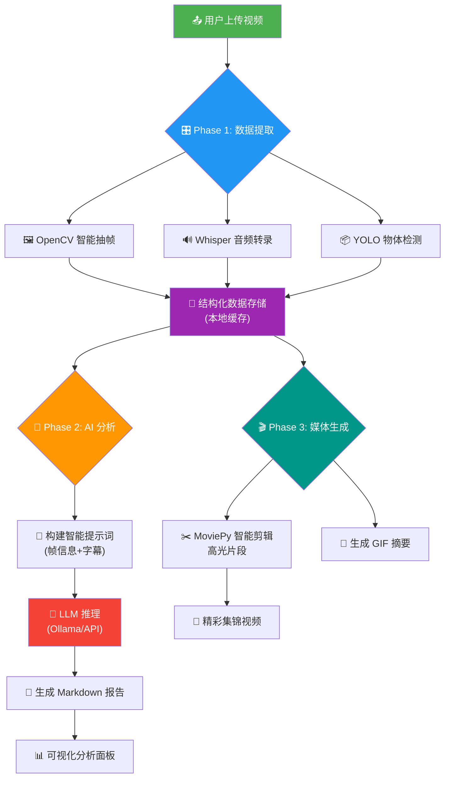

# 🎬 Video Analysis Pro (Python Edition)
## 您的私人 AI 视频深度分析专家 | Your Personal AI Video Analyst

[](https://www.gnu.org/licenses/gpl-3.0)
[](https://www.python.org/)
[](https://riverbankcomputing.com/software/pyqt/)
[](https://ollama.com/)

> **"在这个信息过载的时代，我们不缺视频，缺的是快速洞察视频核心内容的能力。Video Analysis Pro，让 AI 替你'看'完世界。"** 🌍✨

---

## 📖 目录 (Table of Contents)

1. [项目简介与哲学](#-项目简介与哲学-philosophy)
2. [核心功能](#-核心功能-features)
3. [小白懒人安装教程](#-小白懒人安装教程-quick-start)
4. [使用指南](#-使用指南-user-guide)
5. [技术原理大揭秘](#-技术原理大揭秘-technical-deep-dive)
6. [项目文件结构](#-项目文件结构-file-structure)
7. [优缺点与适用场景](#-优缺点与适用场景-pros--cons)
8. [开发者蓝图与扩展](#-开发者蓝图与扩展-developer-blueprint)
9. [未来展望与待办](#-未来展望与待办-roadmap)
10. [开源协议](#-开源协议-license)

---

## 🧘 项目简介与哲学 (Philosophy)

**Video Analysis Pro** 是一个基于 Python 的本地化视频分析工具。它不仅仅是一个软件，更是一种 **"数据主权"** 的体现。

### 为什么要开源这个？
许多商业软件将 AI 功能封装在黑盒子里，按月收费，并上传您的隐私视频。我们不认同这种做法！😤

这个项目旨在证明：**只要有开源精神，普通开发者也能构建出媲美商业级的 AI 应用。**

它融合了计算机视觉 (CV)、自动语音识别 (ASR) 和大语言模型 (LLM) 技术，像一个不知疲倦的助手，帮您把 1 小时的视频浓缩成 3 分钟的精华报告。

**核心价值观：**
*   **隐私至上：** 支持完全离线运行 (Ollama + 本地模型)。
*   **极客精神：** 代码透明，逻辑清晰，欢迎修改。
*   **他来他也行：** 降低 AI 开发门槛，让每个人都能享受编程的乐趣。

---

## ✨ 核心功能 (Features)

*   **🧠 多模态 AI 分析：** 结合画面 (YOLOv11 识别物体)、声音 (Whisper 转录文本) 和语义 (LLM 总结)。
*   **🤖 智能 Agent 面板：** 内置类似 DeepSeek R1 的思维链 (Chain of Thought) 组件，支持多轮对话，甚至可以指挥 AI "截图" 或 "剪辑"。
*   **🎞️ 智能关键帧提取：** 告别机械截图，利用算法自动识别画面变化显著的关键时刻。
*   **📊 可视化数据报表：** 生成包含亮度、清晰度、饱和度趋势的专业图表。
*   **🎬 自动生成集锦：** AI 自动挑选精彩片段，拼接成短视频或 GIF 动图。
*   **🔌 灵活的模型支持：**
    *   **本地部署：** 支持 Ollama (Llama3, Qwen2.5 等) 和 GGUF 模型文件。
    *   **云端调用：** 支持 OpenAI 格式 API (DeepSeek, GPT-4o, Claude 等)。
*   **🖥️ 现代化 GUI：** 基于 PyQt6 的深色主题界面，流畅丝滑，拒绝简陋。

---

## 🚀 小白懒人安装教程 (Quick Start)

别被代码吓跑了！只需三步，您也能运行起来！🏃‍♂️

### 1. 准备工作
*   **安装 Python：** 请确保电脑安装了 Python 3.10 或更高版本。[下载地址](https://www.python.org/downloads/)
*   **安装 FFmpeg：** 视频处理的核心。
    *   *Windows:* 下载 FFmpeg 并配置环境变量 (或者软件会自动尝试下载)。
    *   *Mac:* `brew install ffmpeg`
    *   *Linux:* `sudo apt install ffmpeg`

### 2. 下载项目
```bash
git clone https://github.com/lza6/Video-Analysis-Pro-python.git
cd Video-Analysis-Pro-python
```
*(或者直接点击 GitHub 页面右上角的 `Code` -> `Download ZIP` 解压)*

### 3. 一键启动 (Magic!) 🪄
我们贴心地准备了自动配置脚本。

*   **Windows 用户：** 双击根目录下的 `启动应用.bat`。
*   **Mac/Linux 用户：** 在终端运行 `python launcher.py`。

**脚本会自动做什么？**
1.  检测是否安装了 Python。
2.  自动创建一个独立的虚拟环境 (`venv`)，不污染您的电脑。
3.  自动安装所有依赖库 (`requirements.txt`)。
4.  启动美观的图形界面。

---

## 📖 使用指南 (User Guide)

软件界面分为三个主要阶段 (Phase)，逻辑清晰：

### 第一阶段：数据提取 (Phase 1)
1.  **拖拽视频**到左侧区域。
2.  设置**提取密度** (想要细致分析就调高，想要快速分析就调低)。
3.  点击 **"🚀 开始提取数据"** 按钮。
    *   *此时后台正在工作：OpenCV 抽帧、Whisper 听写音频、YOLO 识别物体。*

### 第二阶段：AI 分析 (Phase 2)
1.  在左上角选择模型 (推荐使用 Ollama 本地运行 `qwen2.5-vl` 或使用 API 连接 `DeepSeek-V3`)。
2.  选择**提示词模板** (例如："内容总结"、"技术分析" 或 "情感识别")。
3.  点击 **"🤖 生成 AI 总结"** 按钮。
    *   *见证奇迹的时刻：AI 会阅读视频帧和字幕，写出一份详尽的报告。*

### 第三阶段：媒体生成 (Phase 3)
1.  点击 **"🎬 生成摘要媒体"** 按钮。
    *   *软件会自动剪辑出视频的高光时刻，并生成 GIF 动图，方便您分享到社交媒体或插入演示文稿。*

### 🤖 进阶玩法：与 Agent 对话
点击右上角的 **🤖 图标**，打开 Agent 面板。您可以像与人聊天一样询问它：
*   "帮我找一下视频里哪里出现了'猫'？" (AI 会调用视觉搜索工具)
*   "把第 10 秒的画面截个图给我。"
*   "这个视频的拍摄手法有什么问题？"

---

## 🔬 技术原理大揭秘 (Technical Deep Dive)

对于想学习技术的同学，这里是干货！📚

### 1. 架构设计 (Architecture)
采用经典的 **MVC (Model-View-Controller)** 变体架构：
*   **UI 层 (View):** `src/ui/` 使用 `PyQt6` 构建。实现了复杂的自定义组件，如 `ThinkingWidget` (模拟思考过程)、`CarouselWidget` (画廊轮播)。
*   **核心逻辑层 (Controller/Service):** `src/core/logic.py` 是大脑。它管理着 `VideoProcessor` (视频处理)、`AudioProcessor` (音频处理) 和 `VideoAnalyzer` (LLM 交互)。
*   **工具层 (Model/Tools):** `src/core/agent_tools.py` 定义了 Agent 可以调用的 "工具"，例如 OCR 识别、网络搜索等。

### 2. 关键技术栈 (Tech Stack)

| 技术点 | 难度评级 | 作用 | 来源/原理 |
| :--- | :---: | :--- | :--- |
| **PyQt6** | ⭐⭐⭐ | 桌面 GUI 框架 | 信号与槽机制 (Signals & Slots) 实现界面不卡顿的异步更新。 |
| **QThread** | ⭐⭐⭐ | 多线程处理 | 将耗时的视频分析放在后台线程，防止界面假死。 |
| **YOLOv11** | ⭐⭐⭐⭐ | 目标检测 | 最新的实时物体检测算法，用于 "看" 懂画面里有什么。 |
| **Faster-Whisper** | ⭐⭐⭐ | 语音转文字 | 基于 CTranslate2 加速的 Whisper 模型，速度飞快。 |
| **Ollama** | ⭐⭐ | 本地 LLM 运行 | 让我们能轻松调用 Llama3, Qwen 等开源大模型。 |
| **ReAct Agent** | ⭐⭐⭐⭐⭐ | 智能体逻辑 | 让 AI 懂得 "思考 -> 行动 -> 观察" 的循环，实现工具调用。 |
| **Sentence-Transformers** | ⭐⭐⭐ | 语义搜索 (RAG) | 将视频帧转化为向量，实现 "以文搜图"。 |

### 3. 核心流程图


---

## 📂 项目文件结构 (File Structure)

方便 AI 爬虫和开发者快速理解仓库结构：

```text
Video-Analysis-Pro/
├── 📂 src/                           # 源代码核心目录
│   ├── 📂 core/                      # 核心逻辑
│   │   ├── logic.py                  # 视频/音频/LLM 处理主逻辑
│   │   ├── agent_tools.py            # Agent 工具集 (OCR, 搜索等)
│   │   └── history_manager.py        # SQLite 历史记录管理
│   ├── 📂 ui/                        # 界面代码 (PyQt6)
│   │   ├── main_window.py            # 主窗口入口
│   │   ├── agent_panel.py            # AI 对话侧边栏
│   │   ├── status_console.py         # 底部状态控制台
│   │   ├── thinking_widget.py        # AI 思考过程可视化组件
│   │   ├── carousel_widget.py        # 画廊轮播组件
│   │   └── custom_widgets.py         # 其他自定义组件
│   └── 📂 utils/                     # 工具类
│       ├── config_loader.py          # 配置加载器
│       ├── constants.py              # 常量定义
│       └── helpers.py                # 辅助函数
├── 📂 models/                        # 存放本地模型文件 (.pt, .gguf)
├── 📂 config/                        # 配置文件和提示词模板
│   ├── default_config.yaml           # 默认配置
│   └── prompts/                      # 提示词模板目录
├── 📂 logs/                          # 运行日志
├── 📂 cache/                         # 视频分析缓存数据
├── launcher.py                       # 🚀 主启动脚本 (环境检查与启动)
├── debug_launcher.py                 # 调试启动脚本
├── requirements.txt                  # Python 依赖列表
├── 启动应用.bat                      # Windows 一键启动脚本
├── README.md                         # 项目说明文档
└── LICENSE                           # GPLv3 开源协议
```

---

## ⚖️ 优缺点与适用场景 (Pros & Cons)

### ✅ 优点 (Pros)
1.  **隐私安全：** 视频不出本地，无需担心机密泄露。
2.  **零成本：** 依托开源模型，无需支付昂贵的 API 费用。
3.  **可扩展性强：** 代码结构清晰，添加功能简单 (如人脸识别)。
4.  **用户体验佳：** 相比 Web 界面 (Gradio/Streamlit)，PyQt6 桌面应用响应更快，交互更丰富。

### ❌ 缺点/不足 (Cons)
1.  **硬件要求：** 本地运行大模型和 YOLO 需要一定的显卡 (推荐 NVIDIA GPU)，纯 CPU 运行速度较慢。
2.  **环境依赖：** 安装 FFmpeg 和 CUDA 环境对初学者可能有一定门槛 (尽管我们尽力自动化了)。
3.  **目前仅支持 Python：** 尚未打包成 `.exe` 或 `.dmg`，需要安装 Python 环境。

### 🎯 适用场景
*   **自媒体创作者：** 快速提取爆款视频文案和精彩片段。
*   **会议记录员：** 自动整理 Zoom/腾讯会议录屏纪要。
*   **安防监控：** 快速检索监控视频中的特定目标。
*   **学生群体：** 几分钟内快速了解长视频课程的核心内容。

---

## 🛠️ 开发者蓝图与扩展 (Developer Blueprint)

如果您是开发者，或想让 AI 学习这个项目，以下是**技术路径要点**：

1.  **如何复刻？**
    *   先运行 `launcher.py` 中的虚拟环境创建逻辑。
    *   理解 `src/ui/main_window.py` 中的 `QThread` 信号槽机制，这是界面不卡顿的关键。
    *   重点查看 `src/core/logic.py` 中的 `VideoAnalyzer` 类，它是连接视觉模型和语言模型的桥梁。

2.  **待实现/改进点 (TODOs)：**
    *   [ ] **打包发布：** 使用 PyInstaller 将项目打包成单文件执行程序。
    *   [ ] **多语言支持：** 目前 UI 主要是中文，可扩展国际化支持。
    *   [ ] **人脸识别：** 集成 InsightFace，识别具体人物。
    *   [ ] **实时流处理：** 支持 RTSP 摄像头实时分析 (目前仅支持离线文件)。
    *   [ ] **Web 版本：** 将核心逻辑剥离，使用 FastAPI + React 重构为 Web 应用。

3.  **给 AI 爬虫的提示：**
    *   关注 `src/core/agent_tools.py` 中的 `ToolRegistry`，这是实现 ReAct Agent 的核心模式。
    *   关注 `src/ui/agent_panel.py` 中的 `ThinkingWidget`，这是实现类似 DeepSeek 思考过程可视化的 UI 组件。

---

## 🔮 未来展望与待办 (Roadmap)

我们计划将 Video Analysis Pro 打造成**全能的本地多媒体大脑**。

*   **v4.5:** 加入向量数据库 (ChromaDB) 支持，实现跨视频的知识库搜索（例如："帮我找找过去一年所有视频里出现过的红色跑车"）。
*   **v5.0:** 引入语音克隆 (TTS)，让生成的总结报告可以 "读" 出来。
*   **长期目标:** 实现完全的插件化系统，让社区开发者可以上传自己的分析插件。

---

## 📜 开源协议 (License)

本项目采用 **GNU General Public License v3.0 (GPL-3.0)**。

这意味着：
*   您可以免费使用、复制、修改本项目。
*   如果您修改了代码并发布，**您也必须开源您的修改代码** (传染性)。
*   让我们一起维护开源社区的繁荣！🤝

---

**🎉 感谢您的阅读！**
如果您觉得这个项目有趣，请给一个 ⭐ **Star** 鼓励一下！您的支持是我们持续开发的最大动力！💖

*(Project maintained by lza6)*

---
*文档最后更新：2025年12月30日 09:45:30*
