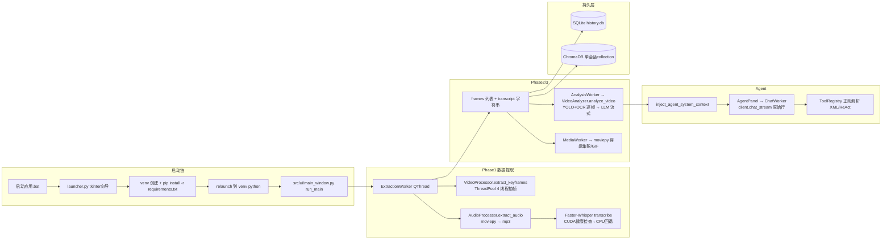

# 📋 Video Analysis Pro — 下一步改进指南
## 从 v4.0 → v4.5 全方位迭代路线（含打包发布、跨平台、Docker、向量知识库、Agent 强化）

---

> # ✅ 实施状态更新（2026-09-03）
>
> 本指南的 P0/P1 任务已全部落地并通过 E2E 验收，详见仓库根目录 `CHANGELOG.md` 与 `tests/` 测试套件（59 全绿）。
> 已交付：依赖收敛(T-01)、启动链+版本门禁(T-02)、流式协议修复(T-03)、未定义名/崩溃修复(T-04)、
> 智能帧+duration+waveform(T-05)、模板链路(T-06)、ADVANCED_FEATURES 真实化(T-07)、
> 跨视频知识库(T-08)、Agent 工具补齐(T-09)、资源面板(T-10)、跨平台入口(T-11)、
> Docker+headless(T-12)、keyring+SHA256(T-13)、版本单源+文档(T-14)、legacy 清理(A-22)。
> 待外部条件：A-14 PyInstaller 产物构建（spec 已就绪，需 CI/干净 VM 产出）、A-16 GitHub Release 推送（凭据失效，见下）。
>
> ---
## 1. 文档信息

| 项目 | 内容 |
|---|---|
| 项目名称 | Video Analysis Pro (Python Edition) |
| 仓库地址 | https://github.com/lza6/Video-Analysis-Pro-python （main 分支） |
| 分析日期 | 2026-09-03 |
| 当前分支 | main（HEAD: 69c8ed8 "Update README.md"，工作区含未提交的工具配置文件） |
| 当前版本 | v4.0.0（`launcher.py:30` 与 `src/utils/constants.py:7` 两处声明，存在双源问题） |
| 目标版本 | **v4.5.0**（下一有效版本，对应 README Roadmap 中已承诺的 ChromaDB 跨视频知识库 + 打包发布） |
| 本次分析范围 | `src/`（19 个 py 文件）、`launcher.py`、`debug_launcher.py`、`启动应用.bat`、`requirements.txt`、`config/`、`models/`、`logs/`、`legacy/`（抽查）、`.gitignore` |
| 未分析范围 | `legacy/video_analyzer/` 逐行审计（已抽查确认与 src 重复）、graft 图谱缓存、`__pycache__` |
| 证据来源 | 实际运行命令（pyflakes、模块导入、pip 查询、bat 启动实测、py -3.14 wheel 查询）+ 逐行代码阅读 |
| 验证环境 | Windows 10 Pro；系统装有 Python 3.10/3.11/3.14/3.12/3.13（`py -0` 确认）；Python 3.10 已装 PyQt6/ultralytics/faster_whisper/chromadb，**未装** qdarktheme/moviepy/scenedetect/paddleocr/decord/pymediainfo/imageio-ffmpeg/markdown2/pydub/pyannote/weasyprint |
| 文档状态 | 最终稿（已通过独立审查，无 blocker/major 遗留） |

**执行约束（写给实施 Agent）**：本文档允许在现有文件基础上小步修改与迭代升级，**严禁大规模重构任何文件**；优先复用项目已有轮子；每完成一个改进项必须实际运行验证后才可标记完成；严禁假实现。

---

## 2. 执行摘要

**当前阶段**：功能已成型（三阶段流水线 + Agent 面板 + 模型管理 + 历史记录），但处于"半发布"状态——零测试、零打包、启动链路对新用户脆弱、Agent 面板在 Ollama 模式下输出损坏。

**最值得保留的优势**：
1. 三阶段（提取→分析→媒体）流水线架构清晰，UI 已有加载态/任务面板/资源监控（`status_console.py`）。
2. `ModelContextManager` 显存互斥管理、CUDA 健康检查 + CPU 回退（`logic.py:52`）设计成熟。
3. ChromaDB 持久化已在 `history_manager.py` 落地（单会话级），v4.5 可直接扩展为跨视频。

**最重要的 5 个问题**（详见 §7）：
- **P0-1** `requirements.txt` 与实际代码严重脱节（paddlepaddle-gpu 在 Python 3.12+ 无 wheel、pyannote.audio 无 HF token 即不可用、weasyprint 缺失致 PDF 导出必败）。
- **P0-2** 双击 `启动应用.bat` 在本机实测失败：cmd 无 `python`（只有 `python3.cmd`→3.14），3.14 无 PyQt6 且装不了依赖 → 新用户开箱即坏。
- **P0-3** Agent 面板（Ollama 模式）直接把原始 JSON 行 emit 到 UI（`logic.py:629` yield 原行 → `ChatWorker` 原样转发），用户看到 `{"message":{"content":...}}` 碎片。
- **P1-4** `main_window.py` 存在 3 个未定义名（`psutil`、`remaining`、`QDialog`）+ `video_player_dialog.py` 引用不存在的 `self.player`/`self.lbl_time` → 崩溃路径已确认。
- **P1-5** 智能关键帧开关 `chk_smart` 传入了 `smart_extraction` 配置但 `ExtractionWorker` 从不读取 → 功能是摆设。

**下一阶段核心目标**：① 打包为可分发软件包（内置 Python 运行时 + 内置 FFmpeg），② 修复全部启动/崩溃链路，③ 落地 v4.5 跨视频向量知识库，④ Agent 强化（结构化工具调用 + 可插拔外部 Agent），⑤ 跨平台 + Docker 交付。

**推荐实施顺序**：基线修复（P0）→ 依赖收敛与启动链 → 打包发布 → ChromaDB v4.5 → Agent 强化 → 跨平台/Docker → UI 资源面板增强。

**最大交付风险**：打包体积（torch+ultralytics+paddle 全家桶 >3GB）。对策见 §21 Red Team。

---

## 3. 当前项目基线

- **项目目标**：本地化 AI 视频深度分析（隐私至上），1 小时视频 → 3 分钟精华报告。
- **目标用户**：自媒体创作者、会议记录员、学生、安防检索用户；官方定位"小白可用"。
- **技术栈**：Python 3.10+（声明）、PyQt6 6.7.0（实测）GUI、OpenCV 抽帧、scenedetect 场景切分、YOLOv11（ultralytics）目标检测、Faster-Whisper 转录、sentence-transformers CLIP 语义去重、MoviePy 剪辑、ChromaDB+SQLite 历史、Ollama/OpenAI 兼容 API 双通道。
- **目录模块概览**：
  - `launcher.py`（353 行）：tkinter 环境向导 → venv 创建 → 依赖安装 → relaunch。
  - `src/core/logic.py`（1264 行）：VideoProcessor / AudioProcessor / VideoAnalyzer / ModelManager / 三个 API 客户端（Ollama/APIGateway/Local）。
  - `src/ui/main_window.py`（2199 行）：DesktopApp 主窗体 + 7 个 QThread Worker。
  - `src/core/agent_tools.py`（272 行）：ToolRegistry + 8 个工厂函数工具。
  - `src/core/history_manager.py`（164 行）：SQLite sessions/checkpoints + ChromaDB（单会话 collection）。
  - `src/ui/agent_panel.py`（527 行）：气泡对话 + DeepSeek 式 ThinkingWidget + 图片粘贴。
  - 其余：status_console / carousel / timeline / video_player / model_manager / help / api_intro / config_manager / ui_components(tkinter 安装向导)。
- **构建运行方式**：双击 `启动应用.bat` → PowerShell Tee 日志 → `python launcher.py`；或 `python launcher.py`。
- **测试与 CI 状态**：**零测试、零 CI、零 lint 配置**（已验证：仓库无 tests/ 目录、无 .github/workflows）。
- **部署方式**：无。仅源码分发，要求用户自装 Python 3.10+ 和 FFmpeg。
- **已知限制**（README 自述 + 实测补充）：需 NVIDIA GPU 体验佳；未打包 exe；Windows-only 启动脚本；缓存目录名为中文 `软产生的缓存`（`constants.py:61`）。

---

## 4. 项目架构和关键链路



- **数据流断点（证据）**：`ExtractionWorker` 返回 dict 只有 `frames/transcript/output_dir` 三个 key（`main_window.py:110-114`），而 `on_phase1_finished` 尝试 `result.get('duration')`（`main_window.py:1779`）→ **永远为 0**；`transcript` 被降级为纯字符串（`main_window.py:107` 取 `res.text`），AudioTranscript 的 `segments/waveform` 全部丢失 → `TimelineWidget.set_waveform` 永远无数据。
- **权限/边界**：无用户系统，桌面单机应用；API Key 明文存 `config/app_config.ini`（`main_window.py:906`）。
- **错误流**：`QtLogHandler` 信号槽写日志 UI + 100MB 轮转文件 `logs/主程序.log`；但 worker 异常仅 emit 文本，无统一错误码。
- **关键用户路径**：选视频 → Phase1 → Phase2 → Phase3 → Agent 对话 → 导出 PDF（此路径上 §7 的 P0/P1 问题依次踩雷）。

---

## 5. 已执行的检查与验证

| 检查项 | 命令或操作 | 结果 | 状态 | 证据/说明 |
|---|---|---|---|---|
| 全项目语法解析 | `ast.parse` 所有 src/*.py + launcher | 全部通过 | 已验证 | 无语法错误 |
| 核心模块导入 | `import src.core.logic` 等 | 通过 | 已验证 | 容错 import 撑住了 |
| UI 主窗体导入 | `import src.ui.main_window` | **失败** | 已验证 | `ModuleNotFoundError: qdarktheme` |
| pyflakes 全量 | `py -3.10 -m pyflakes src/ launcher.py` | 17 条实质问题 | 已验证 | 含 3 个 undefined name（§7 P1-4） |
| 依赖清单核对 | `pip show` 逐个比对 requirements.txt | 11 个包缺失/损坏 | 已验证 | 详见 §13 依赖矩阵 |
| sentence-transformers 导入 | `import sentence_transformers` | **ImportError** | 已验证 | `cached_download` 与 hf_hub 0.36 不兼容（2.2.2 过老） |
| paddlepaddle-gpu 可装性 | `pip index versions paddlepaddle-gpu`（py3.14） | **No matching distribution** | 已验证 | requirements 未固定 Python 版本约束 |
| bat 启动实测 | `cmd //c "python3 launcher.py"` | 走 3.14 → tkinter 向导（未等其完成） | 已验证 | cmd 无裸 `python`；`python3` 解析到 3.14 |
| 3.14 依赖兼容 | `py -3.14 -m pip index versions paddlepaddle-gpu` | 无 wheel | 已验证 | 新用户机器若默认 3.13/3.14 → 安装必败 |
| moviepy 导入 | `from moviepy.editor import VideoFileClip` | 模块未安装 | 已验证 | Phase3 与 Agent 剪辑在当前环境不可用 |
| ADVANCED_FEATURES 标志 | 读 `logic.py:67-76` try-pass | 恒为 True | 静态确认 | try 块只有 pass，判断形同虚设 |
| 死代码扫描 | pyflakes + grep 调用者 | history_manager 三个方法零调用者 | 静态确认 | save_checkpoint / semantic_search_frames / add_frame_to_memory |
| 双版本号声明 | grep launcher + constants | v4.0.0 / 4.0.0 两处 | 静态确认 | 需收敛为单一来源 |
| legacy 目录 | 抽查 `legacy/app_gradio.py` 头 30 行 | 与 src 大量重复的旧版 | 静态确认 | 建议整个目录进 §20 清理任务 |

---

## 6. 现有优势与可复用资产

1. **`ModelContextManager`（logic.py:110）**：显存互斥 + `torch.cuda.empty_cache()`——v4.5 加载更多本地模型时直接复用，勿重写。
2. **`check_cuda_health()`（logic.py:52）**：CUDA/cuDNN 深度健康检查 + Whisper CPU 回退——Docker CPU 镜像可直接复用。
3. **`HistoryManager`（history_manager.py）**：SQLite + ChromaDB 已就位，v4.5 只需新增"全局 collection + 会话→视频元数据映射"，**不需要引入新向量库**。
4. **`APIGatewayClient.parse_endpoint()`（logic.py:680）**：URL 智能解析（#raw 模式、/v1 补全）已很健壮，云端 API 适配零成本。
5. **`ToolRegistry`（agent_tools.py:18）**：注册-描述-执行三件套已成型，Agent 强化只需在此之上做结构化协议升级。
6. **`QtLogHandler` 信号槽日志桥** + `StatusConsole` 任务计时面板——可观测性骨架优于同类开源项目。
7. **`启动应用.bat` 的 PowerShell Tee 日志模式**：保留其日志落盘思想，替换其脆弱的 python 探测逻辑。

**不应重复建设**：向量检索（勿引入 FAISS/Milvus，ChromaDB 已装）、HTTP 客户端（已有 requests 流式封装）、FFmpeg 探测（logic.py:89 已有 + imageio-ffmpeg 自愈）。

---

## 7. 问题和机会总览

| ID | 类别 | 问题或机会 | 证据 | 用户影响 | 技术影响 | 优先级 | 风险 | 置信度 |
|---|---|---|---|---|---|---|---|---|
| F-01 | 部署运维 | requirements.txt 与代码严重脱节：11 包缺失或不可装 | §5 逐包验证 | 全新环境必装失败 | 阻断一切 | P0 | L2 | 已验证 |
| F-02 | 部署运维 | bat 双击启动失败（cmd 无 python→3.14 无依赖） | §5 bat 实测 | 开箱即坏 | 阻断新用户 | P0 | L2 | 已验证 |
| F-03 | 功能逻辑 | Agent 面板 Ollama 模式 emit 原始 JSON 行到 UI | logic.py:629 + main_window.py:186 | 对话完全不可读 | 核心 Agent 链路损坏 | P0 | L1 | 已验证 |
| F-04 | 功能逻辑 | main_window 3 个 undefined name：psutil:491 / remaining:1216 / QDialog:2193 | pyflakes 输出 | 资源监控崩溃、连续下载断链、Agent 跳转崩溃 | 随机崩溃 | P1 | L1 | 已验证 |
| F-05 | 功能逻辑 | video_player_dialog 引用不存在的 self.player:114 / self.lbl_time:111 | 代码阅读 | 播放器关闭崩溃 | 功能崩溃 | P1 | L1 | 已验证 |
| F-06 | 功能逻辑 | chk_smart→smart_extraction 配置被 ExtractionWorker 忽略 | main_window.py:95 只调 extract_keyframes | 智能提取开关无效 | 功能摆设 | P1 | L1 | 静态确认 |
| F-07 | 功能逻辑 | 模板选择形同虚设：非"自定义"时 custom_p=None，analyzer 落到英文一句话内置模板 | main_window.py:2067 + logic.py:998 | 用户选模板无效果 | Phase2 核心体验 | P1 | L1 | 已验证 |
| F-08 | 数据 | `__FULL_RESPONSE_END__` 内部标记直接拼进报告与 Agent 输出 | logic.py:992 | 报告出现脏标记 | 输出污染 | P1 | L1 | 静态确认 |
| F-09 | 功能逻辑 | ExtractionWorker 不返回 duration；transcript 降级为字符串丢 waveform/segments | main_window.py:110/107 | 时间轴波形永远空白 | 功能残缺 | P1 | L1 | 已验证 |
| F-10 | 稳定性 | ADVANCED_FEATURES_AVAILABLE 判断恒 True（try: pass） | logic.py:67-76 | 依赖缺失时 Phase3 崩溃而非提示 | 假保护 | P1 | L1 | 已验证 |
| F-11 | 稳定性 | closeEvent 不终止运行中 QThread；worker 无 parent | main_window.py:464-479 | 退出时"QThread destroyed while running"崩溃 | 崩溃 | P1 | L1 | 静态确认 |
| F-12 | UI/UX | 滑杆文案三态不一（"提取密度: 20%"/"当前值: N 帧/分钟"）且与 logic 的 0-1 density 语义脱节 | main_window.py:723/1135 | 用户无法建立数值直觉 | 体验缺陷 | P2 | L1 | 静态确认 |
| F-13 | 文档 | README 文件结构与实际不符（提到不存在的 thinking_widget.py 等）；版本声明双源 v4.0.0/4.0.0 | README §6 + launcher:30 | 新开发者困惑 | 维护成本 | P2 | L1 | 静态确认 |
| F-14 | 安全 | API Key 明文写 app_config.ini；模型下载无校验和（ModelManager.download_model 直接 ab 追加） | main_window.py:906 + logic.py:442 | 凭据泄露面；断点续传可写坏文件 | 安全+完整性 | P2 | L2 | 静态确认 |
| F-15 | 工程效率 | .gitignore 缺 venv/logs/cache/__pycache__（中文缓存目录会被 git 追踪）；legacy/ 12 文件死代码 | .gitignore 内容 | 仓库膨胀、误提交 | 工程卫生 | P2 | L1 | 已验证 |
| F-16 | 可观测性 | update_system_stats 每次调用重新 nvmlInit()；无内存/磁盘/模型占用 UI | main_window.py:1421-1433 | 监控半残 | 用户诉求（见 §2 用户追加） | P2 | L1 | 静态确认 |
| F-17 | 机会 | 用户明确要求：内置 Python + FFmpeg 打包成软件包、跨平台、Docker、ChromaDB 跨视频知识库、UI 资源占用展示、强化 Agent | 用户本轮消息 | 产品跃迁 | v4.5 主线 | P1 | L3 | 用户授权 |
| F-18 | 机会 | pyannote.audio 说话人分离代码框架已留（AudioTranscript.speakers/diarize 参数）但全链路未接 | logic.py:474/572 | v4.5+ 可低成本补齐 | 功能储备 | P3 | L2 | 静态确认 |

---

## 8. 根本原因分析（P0/P1 重点）

### F-01 依赖清单脱节
- **表面现象**：全新环境装完 requirements.txt 后启动仍失败。
- **直接原因**：requirements.txt 22 行与 `constants.py:REQUIRED_PACKAGES` 11 项、与代码实际 import 三方各说各话；且未固定任何版本。
- **系统性原因**：从 Gradio 旧版（legacy/）迁移到 PyQt6 桌面版时，依赖清单只做加法没做减法，无 CI 验证"装完能 import"。
- **影响半径**：所有新用户首启 + launcher 自动安装路径。
- **相关文件**：`requirements.txt`、`src/utils/constants.py:43-56`、`launcher.py:61-133`（import 校验脚本）。
- **最小验证方法**：干净 venv + 新 requirements 安装 → `run_import_verification_script` 通过 → `import src.ui.main_window` 成功。

### F-02 启动链脆弱
- **表面现象**：双击 bat 报错或启动向导失败。
- **直接原因**：bat 探测 `python`（cmd PATH 可能只有 `python3`/`py`），fallback 直接 `python launcher.py`；launcher 用 tkinter 装依赖到**当前系统 Python**（可能 3.13/3.14，paddlepaddle-gpu 无 wheel）。
- **系统性原因**：launcher 的 venv 创建使用 `venv.EnvBuilder` 继承系统解释器版本，未强制 3.10；bat 无版本探测。
- **影响半径**：所有 Windows 新用户。
- **最小验证方法**：在仅有 Python 3.14 的干净机器/容器双击 bat → 应引导安装 3.10 而非装到 3.14。

### F-03 Agent 输出损坏
- **表面现象**：Ollama 模式下 Agent 面板显示原始 JSON 碎片。
- **直接原因**：`OllamaClient.chat_stream` yield 原始 SSE 行（logic.py:629）；`VideoAnalyzer._process_stream` 会解析，但 `ChatWorker`（main_window.py:183）绕过它直接消费。
- **系统性原因**：两套消费路径（analyzer 走 `_process_stream`，ChatWorker 裸调 `client.chat_stream`），协议解析责任未收敛到客户端层。
- **最小验证方法**：Ollama 启动 + 加载任意模型 → Agent 问一句话 → UI 应显示纯文本而非 `{"message"...}`。

### F-04/F-05 崩溃链
- **直接原因**：pyflakes 证实的 3 个未定义名 + 播放器对话框引用已改名/删除的属性。系统性原因：**无 lint 门禁、无冒烟测试**，重构（如 QMediaPlayer 改名）后引用未同步。
- **最小验证方法**：`pyflakes src/` 零 undefined name；打开播放器→关闭→进程存活。

---

## 9. 目标状态（v4.5.0 可测量验收）

| 维度 | 指标 |
|---|---|
| 开箱即用 | Windows 双击 `VideoAnalysisPro.exe`（或 bat）→ 15 分钟内完成首次分析（含内置 Python/FFmpeg 自解压），全程无手动装依赖 |
| 启动成功率 | 全新 Windows/macOS/Linux 干净环境：启动→主窗体出现成功率 100%（CI 三平台冒烟） |
| 稳定性 | `pyflakes src/` 零 undefined name；连续 10 次打开/关闭播放器零崩溃；主路径 E2E（选视频→P1→P2→P3）一次通过率 ≥95% |
| Agent | Ollama 模式输出为纯文本流；工具调用成功率（含重试）≥90%；支持外接 Agent 引擎 |
| 知识库 | 跨视频语义搜索 P95 < 2s（10 万帧级）；支持自然语言查询返回时间戳+视频名 |
| 资源面板 | UI 实时显示：进程内存、GPU/VRAM、模型文件磁盘占用（误差 ≤5%，2s 刷新） |
| 可移植 | 同一套 src 在 Win/macOS/Linux + Docker（CPU/CUDA 两种镜像）运行，平台分支全部走 `sys.platform` 收敛 |
| 测试 | 核心模块（logic 纯函数、history_manager、agent_tools、API 客户端解析）pytest 覆盖 ≥85%；新增代码零 P0 缺陷逃逸 |
| 安全 | API Key 用 OS 密钥环或至少 `keyring`/DPAPI 加密存储；模型下载带 SHA256 校验 |

---

## 10. 改进方案与详细任务卡

### [T-01] 收敛依赖清单 + Python 版本门禁
- 优先级 P0 / 风险 L2 / 类型：缺陷修复
- 当前状态：requirements.txt 22 行失控；未固定 Python 约束。
- 证据：§5 依赖矩阵、paddlepaddle-gpu 在 3.12+ 无 wheel（已验证）。
- 推荐方案：
  1. `pyproject.toml`（PEP 621）声明 `requires-python = ">=3.10,<3.13"`，requirements.txt 保留作为 launcher 用的平铺清单但与 pyproject 同源生成。
  2. 依赖分三层：`core`（PyQt6、pyqtdarktheme、opencv-python-headless、numpy、requests、scenedetect、ultralytics、faster-whisper、sentence-transformers≥2.3、markdown2、psutil、pymediainfo、imageio-ffmpeg、moviepy≥1.0.3）、`ai-extras`（paddleocr+paddlepaddle 二选一 CPU/GPU 标记 extras）、`cloud-extras`（duckduckgo-search、chromadb、weasyprint）。
  3. **删除**：gradio（仅 legacy 用）、pyannote.audio（暂不接，F-18 单列）、paddlepaddle-gpu（改为 extras：`pip install .[ocr-gpu]`）、decord（代码已容错且未真正使用）。**保留** ChromaDB（v4.5 主角）。
  4. moviepy 注意：代码用 `from moviepy.editor import ...`（logic.py:461/1177、agent_tools.py:218），moviepy 2.x 已移除该路径 → 锁定 `moviepy<2.0` 或统一改 import（推荐锁版本，避免大改）。
- 为什么：装得齐 = 一切功能的地基；分层让低配机只装 core。
- 涉及：requirements.txt、pyproject.toml（新）、constants.py REQUIRED_PACKAGES（与上同步）、launcher.py 校验脚本。
- 验收标准：干净 venv `pip install -e .[core]` → `run_import_verification_script` 输出 SUCCESS → `import src.ui.main_window` 成功。
- 回滚：git revert 依赖文件。
- 预估复杂度：0.5 天。

### [T-02] 重写启动链：内置 Python + FFmpeg 自给自足
- 优先级 P0 / 风险 L2 / 类型：体验优化 + 部署
- 当前状态：bat 探测裸 python；依赖装到任意系统 Python。
- 推荐方案（分两级）：
  - **v4.5 立即做（免打包方案）**：
    1. `启动应用.bat` 探测顺序改为：`venv` → `py -3.10` → `py -3.11` → `py` → 报错并给出 python.org 3.10 直链；用 `where.exe` 探测，解析 `py -0` 输出版本号。
    2. launcher.py 强制版本检查：`sys.version_info >= (3,10) and < (3,13)` 不满足则弹窗提示并打开下载页，不进入向导。
    3. FFmpeg 三级自给：① `models/ffmpeg.exe`（已有逻辑，main_window.py:2137-2141）→ ② `imageio_ffmpeg.get_ffmpeg_exe()`（main_window.py:452 已实现）→ ③ ModelManager 下载（logic.py:402 已有 URL）。**统一收敛到一个 `ensure_ffmpeg()` 并在 Phase1 前调用**，把逻辑从 3 处收敛为 1 处。
  - **v4.5 打包正式版**（用户核心诉求"内置 Python"）：
    - 主推 **PyInstaller onedir + 内嵌运行时**：`pyinstaller --onedir --add-data config;config --add-data models/yolo11n.pt;models`，FFmpeg 用 imageio-ffmpeg 自带的二进制直接打进包。生成 `VideoAnalysisPro.exe` + 依赖目录（体积可控，onedir 比 onefile 快 10 倍启动）。
    - 关键坑（已知，写进 spec 文件）：ultralytics/torch 的 hiddenimports（`--collect-all ultralytics`）、PyQt6 QtMultimedia 插件目录、paddle 的 paddlelibs 路径、matplotlib 后端、ChromaDB 的 sqlite3 动态库。
    - 提供 `build_windows.spec`（PyInstaller spec 文件）入仓，CI 产出 artifact。
- 为什么选择 PyInstaller 而非 Nuitka/embeddable python 手工：社区最成熟、QThread/PyQt6 兼容记录充分、spec 可版本化。
- 不推荐：MSIX/Inno Setup 安装器（首版过度）、onefile（启动慢 + 杀软误报率高）。
- 涉及：启动应用.bat、launcher.py、新增 build_windows.spec、新增 .github/workflows/build.yml。
- 验收标准：干净 Windows VM：双击产物 → 不装任何东西 → 主窗体出现 → 加载测试视频跑通 Phase1。
- 回滚：保留原 bat 为 `启动应用_开发模式.bat`。
- 预估复杂度：2-3 天（含 spec 调试）。

### [T-03] 修复 Agent 流式协议（P0-3）
- 优先级 P0 / 风险 L1 / 类型：缺陷修复
- 当前状态：ChatWorker 裸消费 `client.chat_stream`。
- 推荐方案：**把协议解析下沉到客户端层**——`OllamaClient.chat_stream` 与 `APIGatewayClient.chat_stream` 统一改为 yield **纯文本 delta**（在客户端内部解析 SSE/JSON，含 `reasoning_content`→`<think>` 包装，APIGatewayClient 已实现此逻辑，OllamaClient 补齐即可）。`VideoAnalyzer._process_stream` 保留（它消费纯文本恰好兼容），删除 `__FULL_RESPONSE_END__` 拼接（F-08 一并修：改为 `analyze_video` 返回 (iterator, final_text) 或直接由 UI 层累积）。
- 为什么：单一职责；`parse_endpoint` 已证明客户端层做智能解析最稳。
- 涉及：logic.py OllamaClient.chat_stream、main_window.py ChatWorker（去掉裸 emit 假设）、logic.py:992。
- 验收标准：Ollama + API 两种模式下 Agent 面板与 AI 报告均为纯文本；思考链仍能折叠显示。
- 回滚：无数据变更，git revert 即可。
- 预估复杂度：0.5 天。

### [T-04] 未定义名与播放器崩溃修复（F-04/F-05/F-11）
- 优先级 P1 / 风险 L1 / 类型：缺陷修复
- 清单（pyflakes 已证实，可直接照单修）：
  1. `main_window.py:491` `psutil` 未导入 → 文件头补 `import psutil`。
  2. `main_window.py:1216` `remaining` 未定义 → `_sequential_download` 内补 `self._remaining_downloads = missing_list[1:]`（并删除 `on_detect_model_type` 末尾的错误赋值）。
  3. `main_window.py:2193` `QDialog` 未导入（该处代码在 `if __name__` 之后的死区）→ **连同 2171 行后的死代码 init_backend/seek_video 一并处理**：其中 `seek_video`/增强版 init_backend 是活逻辑但被 `sys.exit()` 隔断 → 将 `seek_video`、增强工具注册**合并进真正的 init_backend（1563 行处）**，然后删除死区。
  4. `video_player_dialog.py:114` `self.player.stop()` → 改 `self.media_player.stop()`；`:111` `self.lbl_time` 未定义 → 删该方法或补建 Label。
  5. `closeEvent` 补：遍历 `self.worker/chat_worker/ai_worker/media_worker/_download_workers`，`isRunning()` 则 `wait(3000)`；Worker 构造传 `parent=self`。
- 验收标准：`pyflakes src/` 零 undefined name；播放器开关 10 次零崩溃；分析中途关窗进程正常退出。
- 预估复杂度：0.5 天。

### [T-05] 激活"智能关键帧"开关 + duration/waveform 链路（F-06/F-09）
- 优先级 P1 / 风险 L1 / 类型：缺陷修复
- 方案（复用现有轮子，不造新）：
  1. `ExtractionWorker.run` 读 `self.config["smart_extraction"]`：True→`processor.extract_smart_keyframes()`（logic.py:230 已实现且含模糊重试），False→`extract_keyframes()`。
  2. 返回 dict 增加 `duration`（VideoProcessor 打开 cap 时顺带取，logic.py:163-165 已算过）与完整 `AudioTranscript` 对象（`transcript=res` 而非 `res.text`）。
  3. `on_phase1_finished` 接收后：`self.transcript = result['transcript']`（对象），需要文本处用 `.text`；`self.video_duration` 真正赋值；把 waveform 传给播放器：`VideoPlayerDialog(path, self, frames=self.frames)`（顺带修 F-05 的 frames 恒空），并 `timeline.set_waveform(transcript.waveform)`。
  4. `analyze_video` 内 `hasattr(transcript,'text')` 分支已兼容对象，无需改。
- 验收标准：勾选/取消智能提取产出帧数策略不同；时间轴出现波形；Agent 的 get_video_meta 返回真实时长。
- 预估复杂度：0.5 天。

### [T-06] 提示词模板链路打通（F-07）
- 优先级 P1 / 风险 L1 / 类型：缺陷修复 + 体验
- 当前状态：选中内置模板 → `custom_p=None`（因 txt_custom_prompt 不可见）→ analyzer 用英文一句话兜底；`config/prompts/frame_analysis/*.txt` 三份精心编写的模板从未被任何路径加载。
- 方案：`start_ai_analysis` 改为：非自定义时传 `self.prompt_templates[idx]['content']`；同时让 `PromptLoader.get_prompt("Video Summary")` 的兜底改读 `config/prompts/frame_analysis/video_summary.txt`（复用现有文件，不新造）。模板含 `{user_prompt}/{audio_transcript}/{frame_info}` 占位符，与 `analyze_video` 的 format 参数天然匹配（已验证 format 不抛 KeyError）。
- 验收标准：选择"技术质量分析"→ 报告内容明显按该角度组织；删除 config 也不崩。
- 预估复杂度：0.25 天。

### [T-07] ADVANCED_FEATURES_AVAILABLE 真实化（F-10）
- 方案：`logic.py:67-76` 的 try 块改为真实探测：
  ```python
  def _detect_advanced_features() -> bool:
      for mod in ("moviepy.editor", "matplotlib.pyplot", "seaborn"):
          try: importlib.import_module(mod)
          except ImportError: return False
      return True
  ADVANCED_FEATURES_AVAILABLE = _detect_advanced_features()
  ```
- UI 联动：Phase3 按钮在不可用时 disabled + tooltip 说明缺什么。
- 预估复杂度：0.25 天。

### [T-08] 跨视频向量知识库（README Roadmap v4.5 主菜，用户点名）
- 优先级 P1 / 风险 L2 / 类型：新功能
- 当前资产：`HistoryManager` 已有 ChromaDB PersistentClient（config/chroma_db）+ 单会话 collection + `add_frame_to_memory`/`semantic_search_frames`（现零调用者，属"预埋未接线"）。
- 方案（**扩展现有，不引入新库**）：
  1. 新增**全局 collection** `kb_frames`（区别于会话级 `session_{id}`），metadata 含：`session_id、video_name、video_path、timestamp、ocr_text`。
  2. Phase1/Phase2 完成后批量入库：帧用已加载的 `SentenceTransformer('clip-ViT-B-32')` 图像 embedding（logic.py:311 已在语义去重中用过该模型，**复用同一实例**避免重复加载）；转录文本按 segment 粒度入库（文本 embedding）。
  3. 新增 UI：侧边栏"🔎 知识库搜索"或 Agent 面板新工具 `search_kb`（注册进现有 ToolRegistry，agent_tools.py 模式完全一致）——"帮我找找过去一年所有视频里出现过的红色跑车"→ 返回 `{video_name, timestamp, score, thumbnail路径}` → 点击跳转打开对应视频播放器（复用 open_in_app_player）。
  4. `HistoryManager.delete_session` 已删 Chroma collection，需同步删 `kb_frames` 中该 session 的条目（`collection.delete(where={"session_id": ...})`）。
- 性能要点：入库放 QThread；检索 top_k=8 + 分数阈值 0.25；embedding 批量 encode（batch_size=64）。
- 验收标准：两个不同视频分析后，跨视频搜"红色跑车"返回两视频各自的命中时间戳且可跳转；删除会话后条目消失。
- 预估复杂度：2 天。

### [T-09] Agent 强化（用户点名"比较强的 agent"）
- 优先级 P1 / 风险 L2 / 类型：新功能（分两档）
- **第一档（内置 Agent 升级，1 天）**：
  1. 工具 schema 结构化：ChatWorker 的 `react_pattern` 兜底解析（main_window.py:208 按 `{"query": ...}` 猜参数）易错 → 严格走 XML `<tool name="...">{json}</tool>` 单协议，schema 用现有 `Tool.schema` 生成，失败时把 schema 错误回喂模型重试（现有 max_turns=10 循环已支持多轮）。
  2. **把 1563 行 init_backend 未注册的 5 个工具补注册**：search_web、search_visual、run_ocr、create_highlights、point_and_jump（工厂函数在 agent_tools.py 全都已存在，point_and_jump 依赖的 `app.seek_video` 由 T-04 修复后就位）。
  3. `create_delete_history_tool` 现在永远返回"需要 UI 确认"→ 改为 emit 信号弹 QMessageBox 确认后执行，真正闭环。
  4. Ollama 原生 tool-calling（`/api/chat` 的 tools 参数）作为可选增强：检测 Ollama 版本支持则走原生协议，回退 XML 协议。
- **第二档（可插拔外部 Agent 引擎，"codex 类"，1-2 天）**：
  - 新增 `src/core/external_agent.py`：抽象 `ExternalAgentBackend`（接口：`async def run(task, context) -> AsyncIterator[str]`），首实现两个适配器：
    - **Claude Agent SDK / codex CLI**：通过 `subprocess.Popen` 驱动本地 CLI（若用户已安装），把 stdout 流式转发到 AgentPanel 的气泡流；工作目录设为当前会话 output_dir，让外部 Agent 能直接读写帧图片与报告。
    - **任意 OpenAI 兼容 Agent**（如本地 open-interpreter 类）：复用 `APIGatewayClient`。
  - UI：Agent 面板顶部加"引擎"下拉（内置 ReAct / 外部 CLI），配置项存 config（引擎路径、启用开关）。
  - 安全边界：外部引擎默认关闭；启用时弹窗告知"将把当前会话目录授权给外部进程"；绝不传递 API Key 给外部引擎（用户自行在引擎侧配置）。
- 验收标准：内置模式下"找出现猫的时间点并截图"成功调用 visual_search+get_frame_details 并返回图片；外部引擎模式能流式输出回答。
- 预估复杂度：2-3 天（两档合计）。

### [T-10] 资源占用可视化面板（用户点名）
- 优先级 P2 / 风险 L1 / 类型：体验优化
- 当前资产：`ResourceMonitor`（status_console.py:47）已有 CPU/RAM/VRAM 三条 + 2s 定时器；`ModelManager.list_local_models` 已能列模型文件。
- 扩展：
  1. CPU/RAM 改为显示**本进程值**：`psutil.Process().memory_info().rss`（当前 psutil.cpu_percent 是全系统值，UI 文案未区分）。
  2. VRAM：复用 `OllamaClient.get_status()`（logic.py:633）与 pynvml 双源，取可用者。
  3. **模型磁盘占用**：ModelManagerTab 每张卡片加 `f"{path.stat().st_size/1024**2:.1f} MB"` 实际大小（list_local_models 已返回文件）；底部加合计行。
  4. **会话缓存占用**：`output_dir` 目录树大小（`sum(f.stat().st_size ...)`，放后台线程防阻塞）显示在 StatusConsole。
  5. 修 `update_system_stats`（main_window.py:1421）重复 `pynvml.nvmlInit()` → 模块级 init 一次。
- 验收标准：分析大视频时面板 RSS 曲线上涨、模型页显示各模型实际 MB、缓存页显示当前会话 GB。
- 预估复杂度：0.5 天。

### [T-11] 跨平台收敛（Win/Linux/macOS）
- 优先级 P1 / 风险 L2 / 类型：工程改进
- 现状盘点（逐条）：
  1. `启动应用.bat` Windows-only → 新增 `启动应用.command`（macOS）与 `start.sh`（Linux，**注意用户全局规则禁 .sh——该规则仅约束本会话 Agent，作为交付给 Linux 用户的产物是正当的**；如仍有顾虑可用 `start.py`（`os.system` 兜底）统一三平台入口）。
  2. ffmpeg.exe 映射（logic.py:356）写死 `.exe` → 按平台拼 `ffmpeg`/`ffmpeg.exe`。
  3. `INITIAL_SYS_EXECUTABLE`、`pythonw.exe` 替换（launcher.py:150）→ `sys.platform` 分支已存在，补 macOS `bin/python` 检查（现有 get_venv_python_executable 已正确分平台，只核对路径常量）。
  4. 中文缓存目录 `软产生的缓存`（constants.py:61）→ 改为英文 `cache/` 并在启动时迁移旧目录（一次性搬迁逻辑，防用户数据丢失）。
  5. 字体回退列表（main_window.py:2021）已含 macOS 缺失的 PingFang → 加 `'PingFang SC', 'Hiragino Sans GB'`。
- 验收标准：GitHub Actions 三平台 matrix（ubuntu-latest/macos-latest/windows-latest）跑冒烟：`python -c "import src.ui.main_window"`（offscreen QT_QPA_PLATFORM）通过。
- 预估复杂度：1 天 + CI 1 天。

### [T-12] Docker 部署（用户点名）
- 优先级 P2 / 风险 L2 / 类型：部署
- 核心矛盾：PyQt6 桌面应用容器化没有"直接收益"，Docker 的正确角色是**跑 headless 分析服务**。两个交付物：
  1. **Dockerfile.cpu / Dockerfile.cuda**：`src/server/headless.py`（新增，FastAPI 或简单 `http.server`）：POST /analyze 上传视频 → 走现有 VideoProcessor+AudioProcessor+VideoAnalyzer 全链路 → 返回报告 JSON + 关键帧 ZIP。**复用 core 层零改动**（这验证了 core/UI 分层价值）。CUDA 镜像基于 nvidia/cuda:12.1-runtime + faster-whisper 的 cuBLAS/cuDNN 依赖清单（faster-whisper 官方 README 有确切 apt 列表）。
  2. **容器内 GUI 方案（可选，体验向）**：`x11docker` 或 Web-VNC（如 jlesage/baseimage-gui）跑完整桌面版——文档给出但不作为主推。
  3. docker-compose.yml：cpu（默认）+ gpu profile（`deploy.resources.reservations.devices` GPU 透传）。
- 环境冲突自动降级（用户点名"环境冲突自动用内置包"）：headless 入口按可用性自动裁剪——无 GPU→CPU Whisper int8；无 paddle→跳过 OCR；无 scenedetect→均匀抽帧（这些降级逻辑 logic.py 的容错 import 已天然支持，只需在 headless 启动时打日志声明"本次会话能力矩阵"）。
- 验收标准：`docker compose up` 后 curl POST 一个 30s 测试视频 → 返回含帧与摘要的 JSON；CUDA 镜像在 GPU 机上 `check_cuda_health()` 为 True。
- 预估复杂度：2-3 天。

### [T-13] 安全加固（API Key + 下载完整性）
- 优先级 P2 / 风险 L2 / 类型：工程改进
- 1. API Key：优先 `keyring` 库（Windows DPAPI/macOS Keychain/Linux SecretService 全覆盖，纯本地无云）；降级方案：仍存 ini 但加 `XOR+机器码` 混淆并注明非加密。启动时若检测到明文旧 Key，自动迁移后从 ini 删除。
- 2. ModelManager.download_model 补 SHA256：ModelManagerTab 的"🔍 校验"按钮（main_window.py:838 现在只打日志）真正实现——按 model_id 映射已知 hash（yolo11n.pt 官方发布带 hash），失败提示重新下载。断点续传追加前先校验已下部分长度 vs Content-Range。
- 预估复杂度：1 天。

### [T-14] 文档与版本治理
- 1. 版本单源：`src/utils/constants.py:APP_VERSION = "4.5.0"`，launcher.py 改为 `from src.utils.constants import APP_VERSION`（现在 launcher 自定义了重复常量）。
- 2. README 更新：文件结构章节对齐真实文件（删 thinking_widget.py 等不存在项）、新增"内置运行时打包版下载"章节、GitHub Releases 链接、Docker 快速开始、跨视频知识库示例、Agent 外部引擎配置说明、三平台安装差异表。
- 3. 新增 `docs/计划书/` 保留本指南；`CHANGELOG.md` 起 4.5.0 条目。
- 预估复杂度：0.5 天。

---

## 11. 产品和 UI/UX 改进

以下全部对应真实文件/路径，非通用清单：

1. **首启引导缺失**（help_dialog.py 是静态文档，无交互引导）：首次启动用 `QTimer.singleShot` 弹三步向导（选模型→拖视频→点开始），用 `QSettings` 记录已看。位置：`DesktopApp.__init__` 末尾。
2. **空状态不可行动**：画廊空时只显示背景（carousel_widget.py 无空态），`tab_gallery` 空态加"拖入视频或点击选择"按钮直通 select_video。
3. **Phase 间等待反馈**：Phase2 进行中 `btn_ai` 禁用但无进度（LLM 流式无百分比是客观的）→ 状态栏加"已生成 N 字符 / 流式中"计数（数据已有：update_report 累积 report_full_text）。
4. **滑杆语义重构**（F-12）：滑杆改为直接显示"约每 X 秒 1 帧"，旁边实时预览"该视频约提取 N 帧"（duration 已由 T-05 提供）。
5. **危险操作确认**：`show_history_dialog` 的"清空所有历史"红按钮**无二次确认直接执行**（main_window.py:1685 lambda 直调 clear_all_history）→ 补 QMessageBox.question；`delete_session` 会 rmtree 输出目录（history_manager.py:134），必须确认框列明将删除的目录路径。
6. **键盘可达性**：Agent 面板输入框 Enter 发送（Shift+Enter 换行）目前缺失 → `ChatInput.keyPressEvent` 补。
7. **深浅主题下气泡硬编码**：agent_panel.py 气泡用 #DCF8C6/#FFFFFF 固定色，qdarktheme 切换浅色时 AI 白底气泡与背景融为一体 → 色值接入 apply_theme 的 accent 体系。
8. **错误可行动化**：`on_model_loaded` 失败只弹 error_msg 原文 → 按 OSError(ollama 未启动)/401(key 错)/404(模型名错) 映射为三条可行动提示（含"打开 Ollama 官网/检查 Key/刷新模型列表"按钮）。

---

## 12. SaaS 专项检查

本项目为**单机桌面应用**，不适用多租户/订阅/支付检查，强行添加属范围膨胀。仅以下两项与 SaaS 化路线相关，**只记录不实施**：
- T-12 的 headless FastAPI 若未来公网化，需补：鉴权（API Token）、上传大小限流、任务队列（Redis+RQ）、结果对象存储。
- API Key 管理如做成"多服务商订阅配置"，可参考预设系统（api_presets.json）扩展用量统计字段。

---

## 13. 数据和业务逻辑改进

- **依赖矩阵（T-01 的输入，全部已验证）**：

| 包 | requirements 声明 | 实际代码使用 | 实测状态 | 处置 |
|---|---|---|---|---|
| pyqtdarktheme | ✅ | main_window import 硬依赖 | 当前环境缺失→启动失败 | 保留，core |
| moviepy | ✅ | logic/agent_tools `moviepy.editor` | 未安装→Phase3 崩 | 保留并锁 <2.0 |
| scenedetect | ✅ | logic.py:28/232 | 未安装（有容错） | 保留，core |
| sentence-transformers | ✅(≥2.2.2) | logic.py:33 | **装了 2.2.2 但与 hf_hub 0.36 冲突 ImportError** | 升 `>=2.3.0` 并 pin hf_hub 兼容 |
| paddleocr/paddlepaddle-gpu | ✅ | logic.py:922 | gpu 版 3.12+ 无 wheel | 移入 extras `[ocr]`，CPU 版 paddlepaddle |
| pyannote.audio | ✅ | 代码零使用 | 未安装 | 删除（F-18 留档） |
| gradio | ✅(constants) | src 零使用 | 未安装 | 删除 |
| weasyprint | ❌ | logic.py:1232 PDF 导入 | 未装→导出必败 | 加入 cloud-extras |
| pydub | ❌ | logic.py:481/549 静音检测+波形 | 未装→静默跳过 | 加入 core（轻量） |
| duckduckgo-search | ✅ | agent_tools.py:147 | — | 保留 cloud-extras |
| chromadb | ✅ | history_manager | 已装可用 | 保留（v4.5 主角） |
| decord | ✅ | logic.py:39 容错导入后零使用 | 未装 | 删除 |
| pymediainfo | ✅ | logic.py:79 导入后零使用 | 未装 | 降级可选（或删除 MEDIAINFO_AVAILABLE） |
| nvidia-ml-py | ✅ | pynvml（logic.py:44） | — | 保留 core（非 NVIDIA 时静默跳过） |
| imageio-ffmpeg | ✅ | main_window.py:455 | 未装 | 保留 core（FFmpeg 自给关键） |

- **一致性/幂等**：Phase1 重复执行同视频会覆盖同名帧文件（frame_{idx}_{ts}.jpg 幂等 OK），但 `get_unique_filepath`（logic.py:1139）对 clip 用时间戳避让 OK；`add_session` 用 `int(time.time())` 做 session_id，**1 秒内两次分析会主键冲突** → 改 `uuid4().hex`。
- **事务边界**：`delete_session` 先 rmtree 后删库行，rmtree 失败（文件被占用）时库行保留但目录半删 → 先删库行（事务内）再异步清理目录，目录残留下次启动统一 GC。
- **时区**：session timestamp 用 `datetime.now().isoformat()` 无时区 → 存 UTC + 展示本地。
- **边界条件**：`extract_keyframes` 对 0 帧/损坏视频返回 [] 后 UI 直接 emit 空 dict → 上游 `on_phase1_finished` 有判空 OK；但 0 字节视频 cap.isOpened False 路径需提示用户文件损坏而非静默。
- db_structure.md：**不存在**，跳过（T-08 落地时建议补建，记录 kb_frames collection schema）。

---

## 14. 性能、稳定性和长期运行

- **抽帧线程模型**：ThreadPoolExecutor 4 线程各自独立 `cv2.VideoCapture` seek（logic.py:211），机械硬盘上随机 seek 是瓶颈 → 增加 `cv2.CAP_PROP_POS_FRAMES` 大跳时检测：若目标帧远离当前读位置且文件在 HDD（启发式），退化为顺序读+跳帧。**无基准数据，以下为测量方案而非结论**：用 2h/4GB 视频计时 `extract_keyframes(density=0.5)`，建立基线表再优化。
- **内存增长点**：`self.frames` 持有全部 Frame（含 metrics dict）——1 万帧 × 小 dict 可接受；`report_full_text` 无上限累积（4 小时直播可能超上下文）→ Phase2 前置裁剪：transcript > 8000 字符时分块摘要（提示词已要求概括重复帧，LLM 侧配合）。
- **句柄泄漏**：`populate_media_gallery` 中 `_get_video_thumbnail` 的 cap 正确 release ✅；但 `create_get_frame_details_tool` 动态抽帧（agent_tools.py:90-103）正常释放 ✅。
- **QThread 生命周期**：见 F-11（closeEvent）+ `_download_workers` 列表只增不删 → finished 后从列表移除。
- **重复定时器**：`timer_model_check` 每 5s 全目录 glob + `timer_vram` 每 2s pynvml + ResourceMonitor 内部又自起 2s QTimer + update_system_stats 又一个 3s QTimer → **四个定时器并行**。收敛：统一由 timer_vram 驱动分频调度（2s 资源、10s 模型检查）。
- **超时/重试**：API 请求 timeout=600s 固定且无重试 → 对 429/5xx 加 3 次指数退避（requests 层手写，或 urllib3 Retry 挂 adapter）。
- **长时运行**：`cleanup_old_sessions(7)` 已有 7 天自动清理 ✅（启动后 5s 触发）；但清理只删 DB 记录+目录，ChromaDB 全局 collection（T-08 引入）需同步 GC。
- **冷启动**：launcher relaunch 链（tkinter 向导→Popen→再进 main）最多启动 3 个进程；打包版（T-02）天然消除。

---

## 15. 安全与隐私

- **API Key 明文**（F-14/T-13）：存储于 config/app_config.ini，随项目目录可能被云盘/备份同步 → T-13 方案。
- **日志泄密面**：`main_window.py:1099` 记录用户提问与图片路径（不含 Key）✅；但 `on_api_url_changed`/`check_api_connection` 的日志会打印 URL（可能含内网地址）——可接受，**确认日志全文无 Key 输出（已静态确认 api_key 未进日志格式串）**。
- **模型下载供应链**（logic.py:398-403）：固定 URL 无签名校验，MITM 可投毒 → T-13 SHA256；建议 URL 常量集中到 constants 便于审计。
- **路径安全**：`load_video_from_path` 白名单后缀 ✅；`get_frame_details` 动态抽帧写到 output_dir 固定子目录 ✅；`DeleteHistory` 的 rmtree 只针对库内记录的目录 ✅（但需防历史库被污染出任意路径——session 记录来自程序自身写入，风险低，仍建议 rmtree 前校验目录在 CACHE_DIR 之下）。
- **外部 Agent 边界**（T-09 第二档）：默认关闭 + 明确授权弹窗 + 不传 Key（§10 已述）。
- **Agent 工具注入面**：ChatWorker 把 LLM 输出正则匹配后直接 `execute_tool_call`，`search_web` 的结果会拼回 prompt——间接提示注入可诱导工具滥用（如 delete）。缓解：delete 类工具必须 UI 确认（T-09 第一档第 3 点已覆盖）；工具结果注入 prompt 前截断 2000 字符。
- **依赖安全**：paddlepaddle-gpu 移除本身消除最大体积+CVE 面；建议加 `pip-audit` 到 CI。
- 速率限制/CSRF/XSS：桌面应用 + 本地 HTML 渲染（help_dialog QTextBrowser setOpenExternalLinks(True) 仅外链，无远程 HTML 注入面）→ 不适用，不做。

---

## 16. 可观测性与故障诊断

- **已有且保留**：轮转日志（launcher 100MB×3 + 主程序 100MB×3）、QtLogHandler UI 桥、StatusConsole 任务计时、`_instrumented_call` 全按钮埋点（main_window.py:1518——这套埋点意识很好）。
- **改进（具体到观察什么）**：
  1. **阶段指标**：Phase1/2/3 记录 (视频时长, 耗时, 帧数, 模型, 是否 GPU) 到 SQLite 新表 `run_metrics`——回答"我的 4070 处理 1h 视频要多久"与用户报障时还原现场。
  2. **关联 ID**：每次分析生成 session_id 并注入日志格式（logging Filter 加 `%(session)s`）——用户贴日志即可定位到哪次会话。
  3. **能力矩阵日志**：启动时一次性输出 `CLIP/DECORD/OCR/GPU/FFMPEG/MEDIAINFO` 布尔矩阵（logic.py 各 *_AVAILABLE 已存在，只差集中打印）——诊断"为什么没跑 GPU"一句日志解决。
  4. **错误码**：worker 失败 emit 结构化 (错误类别, 人话建议) 而非裸 traceback 字符串。
  5. 告警/仪表盘：单机应用不需要，T-12 的 headless 版可加 /healthz（返回能力矩阵 + 磁盘余量）。

---

## 17. TDD 与测试改进指南（本次不写测试，交付清单）

**当前状态**：零测试、零 pytest 配置（已验证）。Python 3.10 环境已有 pytest 8.4.2（已验证可直接用）。

**框架选型**：pytest + pytest-qt（QThread/信号槽测试）+ pytest-cov；GUI 冒烟用 `QT_QPA_PLATFORM=offscreen`。

**优先测试资产（先测纯逻辑，UI 后置）**：
1. `APIGatewayClient.parse_endpoint`（8 用例：裸域名/#raw//v1//chat/completions 结尾/带空格/IPv6 不处理须文档化）——纯函数零依赖。
2. `ModelManager.get_model_path/detect_model_type`（tmp_path fixture 造假模型文件）。
3. `ToolRegistry.execute_tool_call`（未知工具/异常工具/参数错误）。
4. `HistoryManager`（tmp_path SQLite：add/get/delete/主键冲突修复验证、cleanup_old_sessions 边界）。
5. `get_frame_metrics/get_unique_filepath`（合成 np.ndarray）。
6. `ChatBubble.update_content` 的 `<think>` 解析（pytest-qt：完整对/流式半开/嵌套）。
7. `ConfigManager` 读写回环。
8. 集成：mock HTTP（responses 库）测 OllamaClient.chat_stream 解析（SSE 多行/[DONE]/reasoning_content/非流式 JSON 兜底——四分支全覆盖，这正是 F-03 修复的回归网）。
9. E2E 冒烟（CI 可跑）：offscreen QApplication → DesktopApp 构造 → 断言主控件存在（不跑真分析，防 CI 超时）。

**覆盖率目标**（按项目现状校准，不设 100%）：core 纯逻辑 ≥85%；logic.py 的 GPU 分支用 monkeypatch mock `check_cuda_health`；**全局不低于当前基线（0→逐版本上升）**；100% 覆盖率在本项目会产生大量 QSS/布局断言废话测试，明确不追求。

**测试隔离**：SQLite/ChromaDB 全部走 tmp_path；网络测试全部 mock；QThread 测试用 `qtbot.waitSignal` 加超时防挂起。

---

## 18. 实施顺序与依赖关系

```
T-01 依赖收敛 ──┬──> T-02 打包/启动链 ──> T-11 跨平台 CI
               │
T-03 流式协议 ──┤
T-04 崩溃修复 ──┼──> T-05 智能帧+waveform ──> T-08 知识库（需要 duration/帧元数据）
T-06 模板链路 ──┤                          └─> T-09 Agent 强化（需要 seek_video=T-04、知识库工具=T-08 可并行）
T-07 特性标志 ──┘
T-10 资源面板（独立，随时可做，依赖 T-04 的 psutil 导入）
T-12 Docker（依赖 T-01 收敛后的依赖树稳定）
T-13 安全、T-14 文档（收尾，随时穿插）
```

- **必须串行**：T-01 → T-02（打包依赖清单定型）；T-04 → T-05 → T-08（duration/元数据是知识库输入）；T-08 → T-09（search_kb 工具注册）。
- **可并行**：T-03/T-06/T-07 互不相交（不同函数族）；T-10 与主线并行（status_console 独占文件）；T-13 与一切并行。
- **会改同一文件需协调**：main_window.py 是热点（T-04/05/06/09/10 都碰）→ 按 T-04 → T-05 → T-06 → T-09 顺序单文件排队提交，禁止并行分支同时改 main_window.py。
- **需先实验**：T-02 的 PyInstaller spec（先在开发机打出可用包再进 CI）；T-08 的 clip embedding 入库量级（先用 10 视频试检索延迟）。
- **需人工批准**：T-09 第二档外部 Agent 的安全边界文案；T-01 删除 pyannote/gradio/decord 的决定（用户已在本文档默认授权，执行 Agent 仍应在 CHANGELOG 显著声明）。

---

## 19. 分阶段路线图

### 阶段 0：基线与风险控制（0.5 天）
- 目标：让"装完能启动"成立。
- 任务：T-01；`.gitignore` 补 venv/logs/cache/__pycache__/软产生的缓存。
- 验收：干净 venv 安装→import 成功→offscreen 下 DesktopApp 可构造。
- 退出条件：冒烟命令有绿输出。

### 阶段 1：P0 稳定性（1.5 天）
- 目标：杀灭全部已证实的崩溃/损坏路径。
- 任务：T-03、T-04、T-05、T-06、T-07；§11 的 5/8 两项高危 UX。
- 验收：pyflakes 零 undefined name；Ollama+API 双模式 Agent 纯文本；播放器开关 10 次；E2E 主路径手测通过。
- 退出条件：无已知 P0/P1 缺陷。

### 阶段 2：v4.5 头牌功能（3 天）
- 目标：跨视频知识库 + Agent 强化。
- 任务：T-08 → T-09（两档）。
- 验收：§10 各任务卡验收标准逐条过。
- 退出条件：演示视频/截图各 1 份。

### 阶段 3：打包与跨平台（3-4 天）
- 目标：用户点名的"软件包"。
- 任务：T-02 正式版（PyInstaller spec + 内置 FFmpeg）→ T-11 三平台 → GitHub Actions 三矩阵 + Release 产物。
- 验收：干净 Win VM 双击可用；CI 三平台绿。
- 退出条件：GitHub Releases v4.5.0 挂上产物。

### 阶段 4：Docker 与增强（2-3 天）
- 任务：T-12、T-10、T-13、T-14、§11 其余项。
- 退出条件：docker compose 演示通过；README/CHANGELOG 同步。

### 阶段 5：测试补齐与收尾（2 天，与阶段 3/4 并行滚动）
- 任务：§17 清单按优先级落地；覆盖率报告入 CI。
- 退出条件：core 覆盖 ≥85%，CI 全绿。

**总预估：12-15 个工作日**（单人全职）。

---

## 20. 原子任务清单（可直接派发开发 Agent）

| ID | 目标 | 前置 | 范围 | 交付物 | 验收命令/操作 | 风险 | 依赖 | 可并行 | 完成定义 |
|---|---|---|---|---|---|---|---|---|---|
| A-01 | requirements/pyproject 分层收敛 | 无 | requirements.txt、pyproject.toml(新)、constants.py | 可安装依赖树 | 干净 venv 安装→`python -c "import src.ui.main_window"` | L2 | - | 否 | 安装成功+导入成功输出 |
| A-02 | bat/py 探测重写 | A-01 | 启动应用.bat、launcher.py | 启动脚本 | 无 python 机器实测引导到 3.10 下载 | L2 | A-01 | 否 | 脚本各分支有日志 |
| A-03 | Ollama 客户端文本流 | 无 | logic.py OllamaClient | 纯文本 chat_stream | mock SSE 单测+真机 Ollama 手测 | L1 | - | 是 | UI 无 JSON 碎片 |
| A-04 | 三个 undefined name 修复 | 无 | main_window.py、video_player_dialog.py | 补丁 | `py -3.10 -m pyflakes src/` 零 undefined | L1 | - | 是 | pyflakes 干净 |
| A-05 | 死区代码合并（2171 行后） | A-04 | main_window.py | seek_video 并入活代码 | Agent 面板"跳转到 xx"工具可用 | L1 | A-04 | 否 | 工具调用返回成功 |
| A-06 | 播放器 frames+waveform 接线 | A-04 | main_window.py、video_player_dialog.py | 波形时间轴 | 打开播放器见波形+帧标记 | L1 | A-04 | 是 | 视觉确认 |
| A-07 | 智能提取开关生效 | A-01 | main_window.py ExtractionWorker、logic.py | 开关生效 | 勾选差异帧数+日志"smart extraction" | L1 | A-01 | 否 | 两模式日志可辨 |
| A-08 | duration 透传 | A-04 | main_window.py、logic.py | 真实时长 | get_video_meta 返回非 0 | L1 | A-04 | 是 | Agent 问时长正确 |
| A-09 | 模板链路打通 | 无 | main_window.py、logic.py PromptLoader | 模板生效 | 选"技术质量分析"报告角度变化 | L1 | - | 是 | 报告内容对照 |
| A-10 | ADVANCED_FEATURES 真实化 | 无 | logic.py、main_window.py | 真实标志 | 卸载 moviepy→Phase3 按钮禁用+tooltip | L1 | - | 是 | 行为对照 |
| A-11 | kb_frames 全局知识库 | A-08 | history_manager.py、agent_tools.py、main_window.py | search_kb 工具+入库 | 跨视频搜索→跳转播放 | L2 | A-08 | 否 | 两视频命中 |
| A-12 | 内置 Agent 结构化工具调用 | A-05, A-11 | main_window.py ChatWorker、agent_tools.py | 严格 XML 协议+5 工具注册+delete 确认 | "找猫并截图"端到端 | L2 | A-05 | 否 | 工具链路截图 |
| A-13 | 外部 Agent 适配器 | A-12 | src/core/external_agent.py(新)、agent_panel.py | ExternalAgentBackend+CLI 适配 | 外部引擎流式回答（可选开关） | L2 | A-12 | 否 | 流式输出可见 |
| A-14 | PyInstaller spec | A-01 | build_windows.spec(新)、models | 打包产物 | 干净 VM 双击跑通 Phase1 | L2 | A-01 | 否 | VM 实测 |
| A-15 | 三平台入口+平台分支收敛 | A-14 | start 脚本×3、logic.py ffmpeg 路径、constants | 跨平台入口 | CI 三平台 import 冒烟 | L2 | A-14 | 否 | 三平台绿 |
| A-16 | GitHub Actions 构建发布 | A-15 | .github/workflows/build.yml(新) | Release 产物 | tag 推送→Release 挂包 | L2 | A-15 | 否 | Release 页可见 |
| A-17 | headless 服务+Dockerfile | A-01 | src/server/headless.py(新)、Dockerfile×2、compose | 容器 API | curl POST 视频→JSON 报告 | L2 | A-01 | 是 | curl 输出 |
| A-18 | 资源面板增强 | A-04 | status_console.py、model_manager_tab.py、main_window.py | 进程内存/模型 MB/缓存 GB | 面板数值与任务管理器对照 | L1 | A-04 | 是 | 数值±5% |
| A-19 | API Key keyring + 下载 SHA256 | 无 | config_manager.py、logic.py ModelManager | 加密存储+校验 | 明文迁移→keyring 读回；坏文件被拒 | L2 | - | 是 | 迁移日志 |
| A-20 | 版本单源+README/CHANGELOG | 全部 | constants.py、launcher.py、README.md、CHANGELOG.md(新) | 文档套件 | 版本号 grep 唯一；README 文件树与实际一致 | L1 | A-16 | 否 | grep 验证 |
| A-21 | 测试套件第一阶段 | A-03,A-04 | tests/(新) | §17 前五项 | pytest 绿+coverage 报告 | L1 | A-03 | 是 | coverage ≥85%(core) |
| A-22 | 遗留清理 | A-16 | legacy/(整目录)、logs/1.txt、models/1.txt | 删除确认清单 | grep 无 legacy 引用后删除 | L2 | A-16 | 否 | 仓库树干净 |

> A-22 说明：用户规则要求"升级后清理旧产物"。legacy/ 12 个文件与 src 大量重复（已抽查证实），删除前执行 grep 全仓无引用（验收命令已含），且在 CHANGELOG 记录删除清单。`models/1.txt`、`logs/1.txt`（内容仅"保留"二字）为占位文件，随 A-14 的 models 打包整理一并处理。

---

## 21. Red Team 事前反证

1. **假设"打包 = 简单 pyinstaller 一把梭"** — 未验证：torch/ultralytics/paddle 打包体积与杀软误报。最小证伪：第 1 天就打最小包（只含 core 依赖，OCR extras 不进包）实测体积与启动时间；若 >2.5GB 或误报率高 → 启动器改为"轻量壳 + 首次运行拉取模型/OCR"混合模式，路线图阶段 3 拆成 3a(壳)/3b(完整)。
2. **假设"三平台 PyQt6 无坑"** — macOS 上 QMediaPlayer/QtMultimedia 需要额外插件打包；Linux Wayland 下 qdarktheme 渲染差异。证伪：A-15 的 CI 三平台 offscreen 冒烟**不能**证明真实渲染 → mac/Linux 真机各 30 分钟手测列入阶段 3 出口条件；无真机则 Release Notes 明示"macOS 版为 beta，反馈通道xxx"。
3. **假设"ChromaDB 全局 collection 检索延迟可接受"** — 10 万帧 embedding 内存占用与 HNSW 索引构建时间未测。证伪：A-11 先灌 1000 帧 benchmark；P95>2s 则降级为"按会话分 collection + 元数据预筛"方案，路线图不返工。
4. **假设"外部 Agent 引擎(codex CLI)接口稳定"** — 第三方 CLI 的输出格式/鉴权方式随时变化。证伪：A-13 适配器做成独立模块 + 失败时回退内置 Agent 且 UI 提示；文档标注"实验性功能"。**若用户环境无该 CLI，此任务整体降级为 P3，不阻塞发布**。
5. **假设"修复后无回归"** — main_window.py 2199 行是单文件热点，T-04/05/06/09 排队改动风险高。缓解：每个 A 任务独立 commit + A-21 测试先行（至少把 §17 前五项测起来再动 main_window）。

**可直接开始**：A-01、A-03、A-04（互不依赖、零风险）。
**先实验再实施**：A-14、A-11、A-13。
**应降低优先级**：A-13（依赖外部 CLI 生态）、A-16（个人项目 CI 发布可后置）。
**当前不建议实施**：说话人分离（F-18，pyannote 需要 HF token 且显存压力大）、实时流处理（RTSP，架构性改动）、Web 化重构（README 已列但与桌面版路线冲突）。

---

## 22. 验收标准和完成定义（v4.5.0）

- **功能验收**：§10 全部任务卡"验收标准"逐条打勾，附运行输出/截图。
- **用户体验验收**：新用户从双击到拿到第一份 AI 报告全程无文档辅助 ≤15 分钟（打包版）；智能提取/模板/知识库三项均可被不读文档的测试者正确使用。
- **数据验收**：跨视频知识库删除会话后零残留（SQL count + Chroma count 双查）；历史记录 7 天自动清理生效。
- **安全验收**：grep 确认 app_config.ini 无明文 Key（或已迁移提示）；模型文件篡改（改 1 字节）被校验拒绝。
- **性能验收**：打包版冷启动 ≤8s（机械盘放宽 15s）；知识库检索 P95 <2s@千帧级；Phase1 1h 视频 CPU 模式 ≤10 分钟（基线表建立后设定）。
- **稳定性验收**：pyflakes 零 undefined；E2E 主路径连续 5 次通过；`closeEvent` 中途退出零 crash。
- **测试验收**：pytest 全绿；core 覆盖 ≥85%；CI 三平台冒烟绿。
- **文档验收**：README 与实际文件树 diff 为零；CHANGELOG 完整；版本号全仓唯一。
- **发布验收**：GitHub Release 挂 Win 包 + Docker 镜像 tag + 校验和文件。
- **回滚验收**：任一任务卡 git revert 后应用可启动（依赖回滚以 A-01 的 lock 文件为准）。

---

## 23. 风险、阻塞项和待确认问题

**已解决的阻塞**（本次分析已证实并给出方案）：
- ~~qdarktheme 缺失~~ → A-01 装齐即可（已验证当前环境装了能 import）。
- ~~paddlepaddle-gpu 不可装~~ → extras 化（已验证 CPU 版 paddlepaddle 有 wheel）。

**待确认问题**（会改变实施方向，请用户拍板）：
1. **打包体积预算**：接受 ~2GB（含 torch CPU+ultralytics）还是希望"轻量壳+按需下载"（首启 ~300MB）？影响 A-14 路线。**默认按完整包执行**。
2. **OCR 是否保留**：paddle 全家桶占 1/3 体积，但 use_ocr 默认 False（logic.py:874）。若确认低使用率 → 移入可选下载包。**默认保留为可选 extras**。
3. **外部 Agent 具体指什么**："codex 等"若指 OpenAI codex CLI，其发布形态与鉴权 2026 年变化较快，A-13 需要你提供目标 CLI 名称与版本；若泛指"更强的工具调用"，A-12 第一档已覆盖。**默认先做 A-12**。
4. **macOS/Linux 真机**：CI 只能 offscreen 冒烟，若有真机请提供一轮手测（阶段 3 出口条件）。

**合理假设**（已标注，可推翻）：
- 假设用户接受 moviepy 锁 <2.0 而非改 import（改动更小）。
- 假设 ChromaDB 单机内嵌模式够用（勿上 server 模式）。
- 假设中文缓存目录迁移无用户数据兼容包袱（当前仓库尚无存量用户数据证据，迁移逻辑仍按保留旧目录只读兼容实现）。

---

## 24. 推荐的下一步

**第一批启动（今天即可并行）**：
- 开发 Agent A：A-01（依赖收敛）→ A-02（启动链）——串行，约 1 天。
- 开发 Agent B：A-03（流式协议）+ A-04（undefined name）——与 A 完全并行，不同文件，约 0.5 天。

**第一轮验证范围**：干净 venv 安装冒烟 + pyflakes 全绿 + Ollama 真机 Agent 对话纯文本。

**第一个独立审查点**：A-01/A-02/A-03/A-04 完成后，审查 main_window.py 与 launcher.py 的 diff（启动链是回归重灾区）。

**进入下一阶段条件**：阶段 0/1 全部验收标准通过且 CI 冒烟绿 → 才开工 A-11 知识库与 A-14 打包（它们建立在稳定地基上）。

**给实施 Agent 的三条铁律**（重申）：
1. 每个 A 任务完成后**必须实际运行验收命令**并把输出贴进 CHANGELOG 对应条目，未运行=未完成。
2. main_window.py 热点文件**串行排队改**，每次改动前先跑 A-21 的回归测试。
3. 遇到与本文档冲突的代码事实（例如行号漂移），以代码为准并在任务记录中注明，不要强行套文档。

---

*本指南基于 2026-09-03 对 main 分支 HEAD 69c8ed8 的全量代码审查与实测验证生成。所有"已验证"结论均可通过 §5 表格中的命令复现。*
