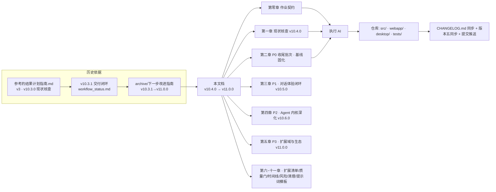
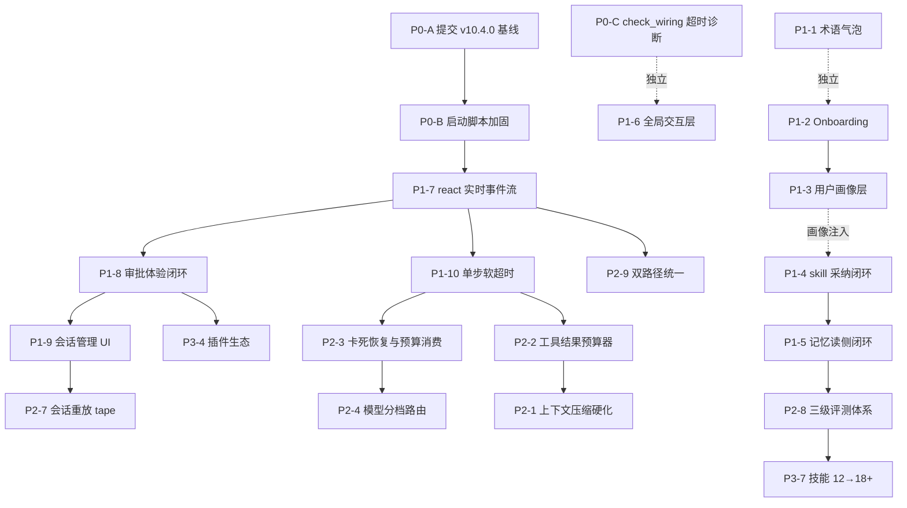

# 下一步改进指南 — TingFeng Hermes v10.4.0 → v11.0.0

> 本文档是 **下一阶段的唯一执行依据**。执行前先读「第零章 给执行 AI 的作业契约」与仓库根目录 `CLAUDE.md` 的项目约定。
> 基线为 **v10.4.0（工作区已实现、未提交）**；目标 **v11.0.0**。上一版指南（v10.3.1 → v11.0.0）已归档至
> `计划书/archive/下一步改进指南.v10.3.1→v11.0.0.2026-09-15.md`，其未完成批次已并入本文档并重新审计。

## 元信息

| 项 | 值 |
|----|----|
| 文档版本 | v2（对应产品版本 v10.4.0 → v11.0.0） |
| 基线版本 | v10.4.0（`src/utils/constants.py:6` 实测 `APP_VERSION = "10.4.0"`） |
| 目标版本 | v11.0.0 |
| 创建/刷新日期 | 2026-09-17 |
| 状态 | 待执行（P0 收尾批次先行） |
| 核查方式 | 本机实测 + 代码审读 + git 状态核实（见第一章） |
| 上一版 | `计划书/archive/下一步改进指南.v10.3.1→v11.0.0.2026-09-15.md`（P0 批次已核销） |

### 关系图（本文档在项目中的位置）



---

# 第零章 给执行 AI 的作业契约（先读这一章）

## 0.1 硬约束（违反即返工）

1. **先读再改**：动任何文件前，先读 `CLAUDE.md`（工程命令/约定/已知坑）、本文档对应批次、以及目标文件的完整代码。
2. **禁止伪造成功**：本地/单测/Mock 证据不得代替浏览器、真实 LLM、真实 DB、真实 E2E 证据。每个批次「验收」里的命令必须实跑并贴输出。
3. **严禁重构**：只做批次内声明的修改；不重写不重建不换架构。已有轮子（`src/core/tools/*`、`src/core/agent/*`、`src/web/routers/*`）优先改造复用。
4. **保护用户工作**：绝不 `git reset --hard` / `checkout -- .` / `git clean` / `git add .`；合并/提交前先 `git status` + `git diff --stat` 核对。v10.4.0 批次尚未提交，**不要把它卷进新的功能 commit**。
5. **TDD 顺序**：先写/改测试（红）→ 实现（绿）→ 回归；禁止先实现后补测试来"凑绿"。
6. **适度验证**：小改动跑最小测试集（如 `pytest tests/test_xxx.py -q`）；跨模块/收尾批次跑全量（本机全量 1481 项实测收集需约 60s，完整跑 10+ 分钟，高负载主机可能更慢——超时不代表失败，优先在 CI 跑全量）。
7. **版本五同步**：`src/utils/constants.py` 的 `APP_VERSION`、`src/web/app.py` 的 `FastAPI(version=...)`、`webapp/package.json`、`desktop/package.json`、`CHANGELOG.md` 必须同版本；另有 `start-desktop.bat` 横幅（当前仍硬编码 `v10.3.1`，见 P0-B）与 `docs/` 引用需一并核对。
8. **提交纪律**：按主题拆 commit；不 push 前先 `git fetch origin --prune` 并对齐远程；严禁 `-f/--force`。

## 0.2 三层交付模型（本项目的核心判据）

| 层 | 含义 | 判据 |
|----|------|------|
| L1 本地闭环 | 代码 + 测试在本机真实跑通 | pytest 绿；接口用真实后端调用返回预期结构 |
| L2 端到端 | 浏览器/Electron 真实用户路径走通 | Playwright 用例绿；审批 SSE、流式、会话恢复等真实 E2E 记录 |
| L3 生产证据 | 打包/发布/多窗口/长跑/多平台证据 | win-unpacked 实测、Release 资产、远程访问、CI 日志 |

本指南各批次「验收」明确标注到哪一层；未到 L3 的不能声称"生产可用"。

## 0.3 单步 Definition of Done（DoD）模板

```
- [ ] 涉及文件清单与实际 diff 一致（git diff --stat 核对）
- [ ] 本批次 TDD 清单全部通过（贴 pytest 输出，含用例数与耗时）
- [ ] 前端改动过 Playwright / 浏览器真实操作验证（贴截图或日志）
- [ ] 版本号/文档/CHANGELOG 同步（若涉及）
- [ ] 无新增 TODO/省略号注释/假实现；新代码有 WHY 注释
- [ ] 回滚路径明确（改了什么、怎么还原）
```

## 0.4 状态声明格式（每个响应开头）

`[Hermes-Guide | <批次号>.<动作> | 进度 x/y]`，例如：
`[Hermes-Guide | P1-7.Implement | 3/8 files done]`

## 0.5 质量门：每次声称"完成"前必须自问

1. 用户能看到/操作到的路径是否真实走通（不是只测了函数）？
2. 失败/空态/加载态/审批超时/断流/重启恢复有没有覆盖？
3. 有没有把"测试通过"和"真实 E2E"混为一谈？
4. 改动是否超出本批次边界、动了别人的工作区内容？
5. 产物（db/日志/缓存）是否留在仓库里或污染了 config/ 目录？

---

# 第一章 现状核查（v10.4.0 真实基线）

> 本章全部为 2026-09-17 本机实测/审读，标注 DIRECT（直接证据）或 INFER（推断）。

## 1.1 项目事实速览（全部 DIRECT）

| 事实 | 证据 |
|------|------|
| 产品名 | TingFeng Hermes（听风·赫尔墨斯）—— 通用全能 AI Agent 桌面平台 |
| 版本 | v10.4.0：`src/utils/constants.py:6` `APP_VERSION = "10.4.0"`；`src/web/app.py` `FastAPI(version="10.4.0")` |
| Git | 分支 `main`；最新提交 `17e85ca`（v10.3.1 终态）；**v10.4.0 批次全部未提交**（26 改 + 15 新增，见 1.2） |
| 架构 | Python FastAPI 后端（`src/web`）+ Next.js 静态导出前端（`webapp/` 14 页）+ Electron 壳（`desktop/`） |
| Agent 内核 | ReactLoopAgent（`src/core/agent/loop.py` 431 行）+ SessionEvent append-only log + 监督层（supervisor 压缩/卡死/预算）+ 分层记忆（working/experience/triples） |
| 工具面 | ToolRegistry 32 工具（legacy 16 + media_gen 4 + web_auto 7 + cdp 5，见 `scripts/wiring_baseline.txt`），scope_guard 审批分级 |
| 测试 | **1481 collected**（本机实测，59s 收集）；v10.4.0 新增测试文件齐全（`test_startup_perf.py` / `test_eli5_coverage.py` / `test_skills_admission.py` / `test_skills_suggestions.py` / `test_plugin_wiring.py` / `test_check_wiring.py` / `test_desktop_wiring.py`） |
| 启动性能 | `import src.web.app` = **10.36s**（本机高负载实测）；`import src.core.agent.loop` = **0.50s**（P0-6 惰性化生效，旧值 19.64s） |
| 技能库 | 12 个内置 skills（surveillance-crowded-scene、surveillance-sparse-corridor 等），roster 按意图路由 + 正文注入（`VAP_SKILLS_BODY_BUDGET` 默认 2000 字符） |
| 记忆 | `MemoryLayeredConnector`（`VAP_MEMORY_LAYERED` 默认 1）：turn 结束写 experience/热层/三元组；热层注入 system 段 |
| 数据库 | config/ 下 SQLite 全家桶：`runs.db` `request_logs.db`(2MB+WAL) `agent_sessions.db` `agent_experiences.db`(1.3MB WAL) `agent_working_memory.db` `agent_triples.db` `im_gateway.db` `provider_presets.db` `history.db` 等（全部已被 .gitignore 收编） |

## 1.2 已交付矩阵（v10.4.0 P0 批次 — 已实现，**待提交核销**）

> 与上一版指南的 P0 对应。代码已落地（工作区），但 **26 个修改文件 + 15 个新增文件均未 commit**——这是当前最大交付风险，P0-A 必须最先处理。

| 批 | 内容 | 状态 | 证据（DIRECT） |
|----|------|------|------|
| P0-6 | 启动性能急救（logic.py 惰性 import / find_spec 探测；29.18s → 1.42s 基线） | 已实现未提交 | `src/core/logic.py` diff + `scripts/measure_startup.py` + `tests/test_startup_perf.py`；本机实测 loop 0.50s |
| P0-5 | eli5 工具面全覆盖（修正 4 个从未命中模板名 + 兜底文案 + 风险前缀） | 已实现未提交 | `src/core/eli5.py` +437 行；`tests/test_eli5_coverage.py`（动态枚举守护） |
| P0-1 | skill 准入闸门 validator 进生产路径（admitted/validation_report + 适配器修复误杀） | 已实现未提交 | `src/skills/distiller.py`；`tests/test_skills_admission.py`（14 用例） |
| P0-2 | SkillAdvisor 进生产路径（GET /api/skills/suggestions） | 已实现未提交 | `src/web/routers/skills.py`；`tests/test_skills_suggestions.py`（9 用例） |
| P0-3 | 插件框架真相化（PluginLoader 接生产 + /api/plugins + config/plugins.yml + 插件 system prompt 注入） | 已实现未提交 | `src/core/plugins/loader.py` +239 行；`src/web/routers/plugins.py`（新文件）；`tests/test_plugin_wiring.py`；`plugins/example-hello` |
| P0-8 | skills 正文注入（预算 2000 字符 + 截断标注） | 已实现未提交 | `agent.py:_build_skills_block` |
| A11 | parse_tool_call 兼容 `<function=NAME>` | 已实现（v10.3.1 已含） | `_FUNC_TAG_RE` |

**未提交清单（git status 实测）**：修改 26 个（`.github/workflows/ci.yml`、`CHANGELOG.md`、`CLAUDE.md`、`desktop/main.js`、`desktop/package.json`、`docs/guide/*`、`src/core/batch_runner.py`、`src/core/eli5.py`、`src/core/logic.py`、`src/core/plugins/__init__.py`、`src/core/plugins/loader.py`、`src/core/run_store.py`、`src/skills/distiller.py`、`src/utils/constants.py`、`src/web/app.py`、`src/web/routers/agent.py`、`src/web/routers/skills.py`、`src/web/services/analyzer_service.py`、`tests/*` 等）；新增 15 个（`.codex/`、`config/plugins.yml`、`plugins/`、`scripts/check_wiring.py`、`scripts/clean_artifacts.py`、`scripts/measure_startup.py`、`scripts/wiring_baseline.txt`、`src/web/routers/plugins.py`、`tests/test_check_wiring.py` 等 7 个测试、`计划书/`）。

## 1.3 残留缺口清单（本次实测/审读，本文档主战场）

### A 类：已建成但**零生产调用方** / 未接线（"定义了但没人用"）

| 编号 | 缺口 | 证据（DIRECT） |
|------|------|------|
| A1 | `AgentConfig.step_timeout_sec`（单步软超时）是**死配置**：`loop.py:59,68` 定义并写文档，`run_turn` 全程未引用，`src/` 与 `tests/` 均无使用点 | `rg step_timeout_sec` 仅 2 处命中（都是声明） |
| A2 | ReactLoopAgent 的 **TurnHooks 未接线到 SSE**：`_build_react_agent`（`agent.py:845+`）构造 agent 时**不传 hooks**，默认 `TurnHooks()` 全 no-op → `ASSISTANT_STREAM` / `TOOL_CALL` / `TOOL_EXECUTE` / `TOOL_POST_EXECUTE` 阶段事件**永远到不了前端**；tool_result 人话只在 `run_turn` 结束后统一补发（`agent.py:_react_run_stream` 注释自认"先保证人话可见"） | 代码审读 |
| A3 | react 路径 `run_stream` 用 **50ms 忙轮询** `asyncio.wait_for(queue.get(), timeout=0.05)` 替代事件通知（`agent.py:_react_run_stream.gen`） | 代码审读 |
| A4 | 审批 SSE 队列是**模块级进程单例**（`_approval_sse_queue()`），多窗口/多请求共享 → 事件互偷、pin 串台（旧指南已知限制，**仍成立**） | `agent.py:81-99` |
| A5 | `SyncLLMClientAdapter.stream` 一次 `asyncio.to_thread` 全量等待同步 cb（`agent.py:254+`）：LLM 长响应期间前端零增量；且 loop.py 里 `chunk.stop_reason` 分支是 `pass`（不终止，靠 final_tool_calls 空判断） | 代码审读 |
| A6 | `scripts/check_wiring.py` 本机运行 **>120s 超时**（未在 2 分钟内出结果）——执行者勿在本机重复长跑，改为 CI 或 `pytest tests/test_check_wiring.py`（有独立快速版） | 本机实测 |

### B 类：能力缺失（用户看得见的功能空洞）

| 编号 | 缺口 | 证据 |
|------|------|------|
| B1 | **无会话管理 UI**：后端 `/api/agent/sessions` 列表/详情/删除齐全，但 agent 页无会话列表/切换/续接/删除入口 → 关窗口后历史"看不见" | `agent/page.tsx` 无 sessions 调用；`agent.py:597+` 端点存在 |
| B2 | **无实时打字机/进度流**：react 路径执行期间前端只有"思考中…"，所有工具事件在 turn 结束后一次性涌入（A2 根因） | `agent/page.tsx:285` `{busy && "思考中…"}` |
| B3 | **审批弹窗无倒计时刷新、无键盘快捷键**：静态文案"60s 后自动拒绝"不实时；无 Enter=允许 / Esc=拒绝 | `agent/page.tsx` 审批 Card |
| B4 | P1 批次（onboarding / 用户画像 / skill 采纳闭环 / 记忆读侧闭环 / 全局 Toast·命令面板）**全部未实现**（旧指南规划，本次复确认） | `rg` 无 onboard/user_profile/staged-adopt/glossary 生产代码 |
| B5 | `APPROVAL_TOOL_CN` / `APPROVAL_CONSEQUENCE` 前端映射只覆盖 15 个工具，**无守护测试**：新增工具后弹窗降级裸名/通用文案 | `agent/page.tsx:56-95` |
| B6 | 前端 `api.ts` 无 **AbortController/超时**：后端挂起时请求无限等待，UI 无重试/取消 | `webapp/src/lib/api.ts` 全文 |

### C 类：性能与质量债（本次实测/审读）

| 编号 | 缺口 | 证据 |
|------|------|------|
| C1 | `import src.web.app` 在本机高负载下 **10.36s**（CHANGELOG 宣称 1.42s 干净环境基线）——需在 CI 固化基准并查明剩余大头（18 个 router + AnalyzerService 等启动导入） | 本机实测 |
| C2 | `derive_messages()` 把 tool_result **全量嵌入** LLM 消息（无预算/截断），长工具输出 = 上下文膨胀 + token 翻倍；`_summarize` 按字面量 `"\\n"` split（应为真实换行） | `session.py` / `loop.py:154-163` |
| C3 | legacy `run_stream` 是**同步生成器**（threadpool 阻塞式跑完 plan），与 react async 版两套实现、SSE 契约不完全一致（step 事件 vs 无 step） | `agent.py:448-496` |
| C4 | 前端轮询治理已好（StatusBar 15s/退避、Dashboard 30s/退避），但各页独立轮询 /api/health，仍存在多页叠加（旧指南记录过"空闲时每页都打"） | `StatusBar.tsx` / `dashboard/page.tsx` 注释 |
| C5 | 本机测试全量耗时敏感：收集 1481 项需 ~59s，个别文件（`test_startup_perf.py`）在高负载主机 >120s 未完成 → 全量请跑 CI，本机用小集 | 本机实测 |

### D 类：文档与实现漂移（会误导后续所有会话）

| 编号 | 漂移 | 证据 |
|------|------|------|
| D1 | `start-desktop.bat` 横幅硬编码 **`v10.3.1`**（应为 10.4.0+） | `start-desktop.bat:24` |
| D2 | `desktop/cleanup-stale.js` + bat 执行 **`taskkill /F /IM electron.exe /T` 全机杀** Electron——多应用桌面上会误杀用户其他 Electron 应用（VS Code 等）；注释自称"只杀 python"但第一步就全杀 electron | `cleanup-stale.js:16-22` |
| D3 | `desktop/test-diag-check.zip`（8.4KB）与 `desktop/test-*.js` 测试残留堆在 desktop/ 根；`.gitignore` 有 `desktop/test-*.js` 但 zip 未收编 | 目录实测 |
| D4 | `.gitignore` 无 `.codex/` 条目（当前 `?? .codex/` 未跟踪）——若需提交工作区会误入 | `git status` |

## 1.4 脏产物 / 缓存清单（本机实测体积）

| 路径 | 说明 | 可删性 |
|------|------|--------|
| `.mypy_cache/` / `.ruff_cache/` / `__pycache__/*` | 静态检查缓存 | 可安全删 |
| `.coverage`（100KB） | 覆盖率缓存 | 可安全删（重跑会重建） |
| `cache/` | 运行缓存 | 需确认后删 |
| `webapp/node_modules/` | 前端依赖（含 playwright） | 保留（依赖） |
| `webapp/out/` | Next 构建产物（生产挂载用） | 保留到下次 build 重建 |
| `desktop/node_modules/` / `desktop/dist/` | Electron 依赖/产物 | 保留 |
| `models/*.pt/.bin/.gguf` | 运行时下载模型（已 gitignore） | 按需保留 |
| `config/*.db*`（含 WAL/SHM） | 运行数据：runs/request_logs(2MB+WAL)/agent_sessions/agent_experiences(1.3MB WAL) 等 | **不可删**（用户数据） |
| `voiceover_placeholder.wav` | 占位音频 | 需确认后删 |
| `desktop/test-diag-check.zip` | 诊断残留 | 可删（见 P0-B/清理章） |

## 1.5 核查命令（可复现，执行方可自行复跑）

```powershell
# 基线事实
git status --short                        # 未提交清单
git log --oneline -5                      # 最新提交
Select-String src/utils/constants.py -Pattern "APP_VERSION"

# 测试
venv\Scripts\python.exe -m pytest --collect-only -q | Select-Object -Last 3   # 1481 collected（~60s）
venv\Scripts\python.exe -m pytest tests\test_eli5_coverage.py tests\test_check_wiring.py -q   # 快速小集

# 启动性能（本机高负载下会偏慢，CI 为准）
venv\Scripts\python.exe scripts\measure_startup.py

# 接线核对（快速版）
venv\Scripts\python.exe -m pytest tests\test_check_wiring.py tests\test_desktop_wiring.py -q
```

> 注意：`scripts/check_wiring.py`（完整版）本机 >120s 未出结果（A6），不要在本机裸跑。

---
# 第二章 P0 收尾批次 — 基线固化（先做，阻塞后续一切）

> 现状：v10.4.0 全部代码已在工作区但 **未提交**；版本号未五同步；启动脚本有漂移。不先固化，后续任何批次都会污染这个未提交基线，diff 不可审查。

## P0-A 提交 v10.4.0 基线（26 改 + 15 新增，按主题拆 commit）

### 根因分析
上一轮执行只完成了代码，没有完成"交付闭环"的最后一步：提交 + 版本五同步 + 发布。工作区堆积了 41 个变更单元，若被 `git reset` / 其他 AI 会话误操作将整体丢失。

### 落地方案
1. `git status --short` + `git diff --stat` 逐文件核对，确认无用户未预期改动。
2. 按主题拆 commit（严禁 `git add .` 一把梭）：
   - `feat(core): 惰性 import 启动性能急救 + 启动基准脚本`（`src/core/logic.py`、`scripts/measure_startup.py`、`tests/test_startup_perf.py`）
   - `feat(agent): eli5 工具面全覆盖 + 动态枚举守护`（`src/core/eli5.py`、`tests/test_eli5_coverage.py`）
   - `feat(skills): validator 准入闸门 + SkillAdvisor 建议端点`（`src/skills/distiller.py`、`src/web/routers/skills.py`、`tests/test_skills_admission.py`、`tests/test_skills_suggestions.py`）
   - `feat(plugins): 插件框架接生产路径 + /api/plugins + 配置清单`（`src/core/plugins/*`、`src/web/routers/plugins.py`、`config/plugins.yml`、`plugins/`、`tests/test_plugin_wiring.py`、`tests/test_desktop_wiring.py`）
   - `test(wiring): check_wiring 脚本 + 基线 + 配套测试`（`scripts/check_wiring.py`、`scripts/wiring_baseline.txt`、`tests/test_check_wiring.py`）
   - `chore(docs): CHANGELOG v10.4.0 + CLAUDE.md + docs/guide 同步`（`CHANGELOG.md`、`CLAUDE.md`、`docs/guide/*`、`webapp/package.json`、`desktop/package.json`）
3. 版本五同步：`constants.py` / `web/app.py` / `webapp/package.json` / `desktop/package.json` / `CHANGELOG.md` 全部对齐 **10.4.0**；`start-desktop.bat` 横幅改版本号（或改为读 `desktop/package.json`，见 P0-B）。
4. 全量验证（CI 或本机低负载时段）：`pytest -q`（1481 项）；`--cov=src` 覆盖率 ≥ 80%。
5. `git fetch origin --prune` → 按主题 push → 打 tag `v10.4.0` → 构建 Release 资产（参照 `scripts/create_release_v1031.py` 流程）。
6. 更新 `workflow_status.md` 为 v10.4.0 终态（全部 VERIFIED）。

### 涉及文件
- 提交对象：上述 41 个变更单元；流程脚本：`scripts/create_release_v1031.py`、`scripts/clean_artifacts.py`
- **不动**：`计划书/`（本文档属未跟踪规划文档，不入本次代码提交；如需入库单独拆一个 docs commit）

### TDD 测试清单
- [ ] `pytest tests/test_startup_perf.py tests/test_eli5_coverage.py tests/test_skills_admission.py tests/test_skills_suggestions.py tests/test_plugin_wiring.py tests/test_check_wiring.py tests/test_desktop_wiring.py -q` 全绿（CI 跑）
- [ ] 全量 `pytest -q` 绿（CI）
- [ ] `git diff --stat` 与预期清单一致（26M+15A）
- [ ] `git ls-files` 确认 `.codex/`、`config/*.db*`、`webapp/out/` 未被误入版本库

### 验收
- `git log --oneline -8` 显示按主题的 v10.4.0 提交序列；`git tag v10.4.0` 指向最新；Release 资产 state=uploaded。
- 若无法 push（无授权），交付到「本地提交完成 + 远程待推」并明确标注，不伪造远程证据。

### 回滚
- 未 push：`git reset --soft <前一个提交>` 可整体退回工作区状态。
- 已 push：按主题 revert，不回写历史。

### 风险
- 工作区有 `.codex/` 等非项目文件 → 提交前必须逐文件确认，禁止 `git add .`。
- 用户可能正在用该工作区跑其他任务 → 提交前先确认无并发修改（`git status` 前后对比）。

## P0-B 启动脚本加固（版本漂移 + 全机杀 Electron）

### 根因分析
1. `start-desktop.bat` 横幅写死 `v10.3.1`（D1）——每版本都要手改，且必然漏改。
2. `cleanup-stale.js:16` 第一步就 `taskkill /F /IM electron.exe /T` **全机杀** Electron（D2）——用户开着 VS Code / 其他 Electron 应用时会被无辜杀掉；这与 bat 注释"只杀 python，不动系统服务"的自述矛盾，属于**危险残留**。

### 落地方案
1. 版本号去硬编码：bat 横幅改为从 `desktop/package.json` 读 version（PowerShell 一行解析或 `node -p "require('./package.json').version"`），消除 D1。
2. 精确杀进程：`cleanup-stale.js` 第一步改为**只杀本应用**：
   - 用 `wmic`/PowerShell 枚举 electron.exe 的 `CommandLine`，仅匹配含本仓库 `desktop` 路径或 `--app=...` 标识的 PID；
   - 或给 Electron main 传 `--hermes-app-id` 参数，按参数匹配；
   - 兜底：匹配不到时打印提示而不是全杀。
3. 端口清理保持现状（netstat 8000-8019 + 仅杀 python），但同样加"命令行含本项目 venv/src"过滤，避免误杀用户其他 python 服务。
4. 补测试：`tests/test_desktop_wiring.py` 增加"清理脚本不匹配其他 Electron 路径"的静态断言（读脚本内容或抽纯函数）。

### 涉及文件
- `desktop/cleanup-stale.js`、`start-desktop.bat`、`desktop/main.js`（如需传应用标识）、`tests/test_desktop_wiring.py`

### TDD 测试清单
- [ ] 新增用例：给定伪造 tasklist 输出（含 VS Code electron.exe + 本项目 electron.exe），断言只杀本项目 PID（抽纯函数后单测）
- [ ] 静态断言：脚本中不存在裸 `taskkill /F /IM electron.exe` 调用（或仅在确认无其他匹配时执行）
- [ ] bat 横幅断言：不包含硬编码 `v10.3.1`；版本来自 package.json

### 验收
- 本机执行 `start-desktop.bat` 后：本项目 Electron 正常启动；同机其他 Electron 应用（如 VS Code）存活。
- `logs/desktop.log` 无全杀告警；版本横幅显示 10.4.0。

### 回滚
- 单文件改动，`git checkout -- desktop/cleanup-stale.js start-desktop.bat` 即可还原。

### 风险
- Windows 下按命令行匹配 PID 有编码/转义坑——优先抽纯函数 + 单测覆盖，再集成到脚本。

## P0-C scripts/check_wiring.py 本机超时诊断

### 根因分析
`scripts/check_wiring.py` 本机 >120s 未出结果（A6），推测在收集阶段真实 import 了重依赖（torch/sentence_transformers 等）或对每个工具做真实调用验证。

### 落地方案
1. 诊断：`python -X importtime scripts/check_wiring.py` 定位耗时 import；或读脚本确认是否误触发重依赖。
2. 修复：改为**纯静态**核对（import 元数据 + 注册表枚举 + 基线文件 `wiring_baseline.txt` diff），不触发重依赖；或增加 `--quick` 模式只跑注册表枚举。
3. 明确文档：README/CLAUDE.md 标注"完整版仅 CI 跑，本机用 `pytest tests/test_check_wiring.py`"。

### 涉及文件
- `scripts/check_wiring.py`、`scripts/wiring_baseline.txt`、`tests/test_check_wiring.py`、`CLAUDE.md`

### TDD 测试清单
- [ ] `timeout 60` 内 `python scripts/check_wiring.py --quick` 完成并 exit 0
- [ ] `pytest tests/test_check_wiring.py -q` 绿

### 验收
- 本机 60s 内出结果；CI 全量版仍验证 32 工具接线与基线一致。

### 回滚
- 脚本级改动，git 还原即可。

---

# 第三章 P1 批次 — 对话体验闭环（v10.5.0）

> 目标版本 v10.5.0。本章 = 旧指南 P1-1~P1-6（保留，经复确认仍成立）+ **本次新审计的 P1-7~P1-10**（react 实时流/审批体验/会话管理/软超时——都是用户可见的高价值缺口）。
> 执行顺序建议：P1-7 → P1-8 → P1-9 → P1-10 → P1-6 → P1-1 → P1-2 → P1-3 → P1-4 → P1-5（实时流与审批是对话体验的地基；记忆/skill 闭环是"自进化"主线）。

## P1-7 react 实时事件流（新，最高优先）

### 根因分析
A2 已证：`_build_react_agent` 构造 `ReactLoopAgent` 时**不传 hooks**，`TurnHooks()` 默认实现全 no-op（`turn.py`），导致 loop.py 里所有 `await turn.emit(TurnPhase.ASSISTANT_STREAM / TOOL_CALL / TOOL_EXECUTE / TOOL_POST_EXECUTE / STEP_END ...)` 都"发射到虚空"。`_react_run_stream` 只能：轮询审批队列 + turn 结束后从 session 事件补发 tool_result 人话。用户看到的是"思考中…"数秒/数十秒后一次性刷屏，**没有任何实时反馈**——这是当前产品体验的第一短板。

### 落地方案
1. 在 `_build_react_agent` 构造 hooks：把 TurnHooks 的每个 phase 回调编码成 SSE 事件文本，`put_nowait` 进**当前请求的**审批/事件队列（与 P1-8 的分队列改造共用基础设施）。
2. 事件契约（新增事件类型，向后兼容）：
   - `assistant_delta` → `{delta: str}`（打字机；loop 的 ASSISTANT_STREAM）
   - `tool_start` → `{tool, args}`（TOOL_CALL/TOOL_PRE_EXECUTE）
   - `tool_done` → `{tool, human?, ok, error?}`（TOOL_POST_EXECUTE；human 用 eli5）
   - `step` → `{index}`（STEP_END）
   - 保留 `approval-request`、`tool_result`、`done` 现有事件。
3. 前端 `agent/page.tsx`：`assistant_delta` 追加到当前 agent 消息（流式 append）；`tool_start/done` 渲染为实时状态行（⚙️ 执行中… → ✅ 完成）；不再等 done 才刷屏。
4. 队列改造前置（与 P1-8 合并）：模块级单例队列 → 按 `session_id` 分队列的 `ApprovalEventBus`，`_react_run_stream` 从自己队列消费；`get_approval_bus()` 保留兼容层。
5. 移除 50ms 忙轮询：用 `asyncio.Queue` + `run_turn` 完成事件（`task` 结束后 `queue.put_nowait(sentinel)`）替代 `wait_for(queue.get(), 0.05)` 循环。
6. `SyncLLMClientAdapter` 保持同步桥接（大改属于重构，禁止）；实时性靠事件流解决，不追求逐 token（A5 列为后续 P2-9 候选）。

### 涉及文件
- `src/web/routers/agent.py`（hooks 构造、队列、gen）、`src/core/agent/turn.py`（如需取 human 字段）、`webapp/src/app/(app)/agent/page.tsx`、`webapp/src/lib/types.ts`、`tests/test_agent_router_react.py`

### TDD 测试清单
- [ ] 单测：构造 Mock hooks，断言 ASSISTANT_STREAM 回调产出 `assistant_delta` SSE 文本（事件契约）
- [ ] 单测：两个并发 session 的 run_stream，审批事件互不串台（分队列语义）
- [ ] 单测：run_turn 结束（done/sentinel）后 gen 正确退出，无残留队列事件
- [ ] 单测：`tool_done` 事件携带 eli5 human 文本（可空）
- [ ] E2E（Playwright）：真实/模拟 LLM 下，agent 页执行期间能看到增量文本与工具状态行，且审批弹窗出现时流未阻塞
- [ ] 回归：`tests/test_agent_router_react.py`、`tests/test_agent_router_assembly.py` 全绿

### 验收
- 浏览器打开 Agent 页，发起含工具调用的任务：先看到流式文本/工具状态，再看到审批弹窗，结束后 done 正常；两个浏览器窗口各跑一个 session 不互相抢事件（L2 实测，贴日志）。

### 回滚
- 若事件契约导致前端解析失败：前端对未知事件类型默认忽略（readSSE 已按 event 名分发，未知即 continue）→ 后端回滚 hooks 代码即可，前端零改动回退。

### 风险
- 事件顺序：tool_done 必须在 approval-request 之后？不需要——审批事件独立于 phase 事件，前端按 pin 处理，互不干扰。
- eli5 在 hooks 里抛异常：已有 try/except 兜底（不阻断），沿用。

## P1-8 审批体验闭环（倒计时 / 快捷键 / 分队列 / 映射守护）

### 根因分析
B3/B4/A4/B5 合并：审批弹窗静态文案无倒计时、无键盘快捷键；多窗口共享全局队列会串事件；前端工具中文映射无守护。

### 落地方案
1. 前端：审批弹窗加**实时倒计时**（timeout 秒倒计时显示，最后 10s 高亮，归零自动关闭并提示已拒绝）；`Enter`=允许、`Esc`=拒绝（仅在弹窗打开时生效，避免误触输入框）；弹窗打开时输入框禁用。
2. 后端：审批队列按 session 隔离（P1-7 的 bus 改造）；`pending` 端点按 session_id 过滤（`/api/agent/approval/pending?session_id=…`）。
3. 映射守护：把 `APPROVAL_TOOL_CN`/`APPROVAL_CONSEQUENCE` 抽到 `webapp/src/lib/approvalMaps.ts`，新增 `tests/`（前端 vitest 或由后端测试枚举注册表比对缺失项）——工具名来自后端 `/api/agent/tools` 或 `scripts/wiring_baseline.txt`，新增工具忘映射 → 测试红。
4. 弹窗可最小化/排队：同一 turn 多个写工具时，审批请求排队显示（当前一个覆盖一个）。

### 涉及文件
- `webapp/src/app/(app)/agent/page.tsx`、`webapp/src/lib/approvalMaps.ts`（新）、`webapp/src/lib/types.ts`、`src/web/routers/agent.py`、`src/web/deps.py`（ApprovalBus 分队列）、`tests/test_agent_router_react.py`、后端或前端新增映射守护测试

### TDD 测试清单
- [ ] 单测（前端逻辑抽纯函数）：倒计时从 timeout 递减、归零触发"已拒绝"回调
- [ ] 单测：快捷键 Enter/Esc 映射（jsdom 模拟 keydown，弹窗打开才生效）
- [ ] 后端：同 session 两写工具 → 两个 pin 顺序可决，互不覆盖；异 session pin 拒绝不影响对方
- [ ] 映射守护：枚举 wiring_baseline 中写/危险写工具名，断言 approvalMaps 有中文名+后果文案
- [ ] Playwright：审批弹窗出现 → 按 Esc → 工具被拒（后端 tool_result denied）；再跑一次按 Enter → 允许

### 验收
- 浏览器实测：弹窗倒计时实时走；Esc 拒绝后 agent 消息流出现"⛔ 审批[已生效]…"；多窗口不串台（L2）。

### 回滚
- 前端快捷键/倒计时为纯展示层，回退无风险；后端分队列改动回退到单例 + 文档标注限制即可。

### 风险
- 快捷键与输入法冲突（中文输入 Enter 上屏）：Enter 监听需排除 IME composing（`e.nativeEvent.isComposing` 或 keyCode 229）。

## P1-9 会话管理 UI（列表 / 切换 / 删除 / 续接）

### 根因分析
B1：后端 `/api/agent/sessions`、`/sessions/{id}`、`/sessions/{id}/turns`、DELETE 全部就绪（`agent.py:597-687`），但前端完全没有会话列表入口——Session 持久化的价值用户看不见。

### 落地方案
1. Agent 页左侧/抽屉加会话列表：调用 `GET /api/agent/sessions`，显示最近会话（标题=首条 user 消息截断、时间、事件数）。
2. 新建会话 / 切换会话：切换后 `session_id` 更新，消息区加载 `GET /sessions/{id}` events 重建对话（user/assistant 消息渲染，tool_result 折叠）。
3. 删除会话：确认弹窗 → `DELETE /sessions/{id}` → 列表刷新（幂等 204）。
4. 空态：无会话时显示引导（"新建对话开始…"，为 P1-2 onboarding 铺路）。
5. 会话标题生成：首条消息前 24 字 + 日期；`turns` 端点可用于渲染时间轴（可选增强）。

### 涉及文件
- `webapp/src/app/(app)/agent/page.tsx`、新 `webapp/src/components/agent/SessionList.tsx`（新）、`webapp/src/lib/types.ts`、`webapp/src/lib/api.ts`（如需带 query 的 GET）、`tests/`（后端已有 sessions 测试，主要补前端 Playwright）

### TDD 测试清单
- [ ] 后端回归：`tests/test_session_store*.py`、`test_agent_router_react.py`（sessions 端点）绿
- [ ] Playwright：建 2 个会话 → 列表出现 2 条 → 切换回第 1 条历史消息正确显示 → 删除第 2 条 → 列表剩 1 条
- [ ] 空态断言：无会话时显示引导文案
- [ ] 会话消息渲染断言：user/agent 消息顺序、tool_result 不直接刷屏（折叠/摘要）

### 验收
- 浏览器实测：关掉窗口重开（或刷新页面），会话列表还在，点开能续接历史（L2）。

### 回滚
- 纯前端新增组件 + 后端无改动（后端已就绪），回退 = 移除组件挂载。

### 风险
- 会话列表随 sqlite 增长变大 → 列表接口已有 `limit=100`，够用；后续可加分页。

## P1-10 单步软超时接线（step_timeout_sec）

### 根因分析
A1：`AgentConfig.step_timeout_sec` 定义在 `loop.py:59,68`、文档写了"单步超时（None=不超时）"，但 `run_turn` 从未使用——LLM stream 只有 `asyncio.TimeoutError` 被动兜底（那是整轮流超时，不是单步），卡死工具/挂起 LLM 时整轮悬挂，监督层 stuck 检测（supervisor）只能事后识别。

### 落地方案
1. `run_turn` 内：给「LLM stream 请求 + 工具执行」包 `asyncio.wait_for`，超时用 `step_timeout_sec`（None=维持现状零回归）。
2. 超时语义：LLM 超时 → `TurnStopReason.ERROR`（error="step timeout(LLM)"）并 break；工具执行超时 → 记 tool_result Error（不中断整轮，进入 stuck 检测，让 supervisor 决定 pause/stop）。
3. 配置接线：`_build_react_agent` 从环境变量 `VAP_AGENT_STEP_TIMEOUT`（默认 None/0=关）装配到 AgentConfig。
4. 补注释：删除/修正"单步超时"与实现的矛盾（D 类漂移修复）。

### 涉及文件
- `src/core/agent/loop.py`、`src/web/routers/agent.py`（装配）、`tests/test_supervisor.py`、`tests/test_agent_router_react.py`、新增 `tests/test_step_timeout.py`

### TDD 测试清单
- [ ] 单测：step_timeout_sec=0.1 + MockLLM sleep 0.5 → 结果 stop_reason=ERROR(error 含 timeout)，不悬挂
- [ ] 单测：step_timeout_sec=0.1 + Mock 工具 sleep 0.5 → tool_result 为 Error，轮次继续，stuck 检测能观察到
- [ ] 单测：step_timeout_sec=None → 行为与现状一致（回归）
- [ ] 装配单测：`VAP_AGENT_STEP_TIMEOUT=1.5` → AgentConfig.step_timeout_sec==1.5

### 验收
- 用真实慢 LLM 或打桩验证：单步超过阈值后 turn 终止/降级可观测（L1）。

### 回滚
- 仅 loop.py 行为分支 + env 开关，`VAP_AGENT_STEP_TIMEOUT` 不设即零回归。

### 风险
- `wait_for` 取消协程后工具可能留下半执行副作用（写文件）——工具超时仅标记 Error 不硬杀，配合 scope_guard 审批语义文档化。

## P1-6 全局交互层（旧批次保留 + 新发现合并）

### 根因分析
旧指南已列：无 Toast / 命令面板 / 快捷键 / 骨架屏 / 空态统一。本次新增 B6：`api.ts` 无超时/AbortController，后端挂起 → 前端无限等待。

### 落地方案
1. `api.ts` 封装统一 `fetchWithTimeout(path, opts, timeoutMs=15000)`（AbortController），超时抛 `ApiError(408)`；失败重试策略：GET 幂等请求最多 1 次退避重试。
2. 轻量 Toast 组件（成功/错误/信息，自动消失，aria-live polite）；错误统一入口：`ApiError` → Toast + 控制台。
3. 命令面板（Ctrl+K）：跳转页面 / 新建分析 / 新建对话 / 打开设置；快捷键注册表（集中管理，防冲突）。
4. 骨架屏：dashboard / agent / analyze 三个主页面加载态替换裸"加载中…"。
5. 空态规范：列表类页面（gallery/media/logs/requests/decisions/skills）统一 EmptyState 组件（图标+文案+CTA）。

### 涉及文件
- `webapp/src/lib/api.ts`、新 `webapp/src/components/ui/Toast.tsx`、新 `webapp/src/components/ui/EmptyState.tsx`、`webapp/src/app/(app)/layout.tsx`（挂 Toast 容器）、`webapp/src/components/shell/AppShell.tsx`（命令面板入口）、相关页面

### TDD 测试清单
- [ ] api 超时单测（jsdom/mock fetch 不 resolve → 15s 后抛 408；可注入短超时）
- [ ] Toast 自动消失 + aria 断言
- [ ] Ctrl+K 打开命令面板、Enter 跳转路由（Playwright）
- [ ] 三个主页面骨架屏存在性断言（Playwright）

### 验收
- 断网/停后端刷新任意页：出现 Toast 报错而非无限 loading；Ctrl+K 可用（L2）。

### 回滚
- 全部为增量组件 + 封装，回退=卸载挂载点。

## P1-1 术语气泡（旧批次保留）

> 内容沿用旧指南（附录 C 术语表随行），执行者读取归档版补齐细节。摘要：分析页/Agent 页对专业术语（抽帧、帧差、YOLO、Whisper、RTSP、SSE、token 等）提供悬浮解释气泡；为小白用户默认开启，设置可关。

## P1-2 Onboarding + 首页重构（旧批次保留）

> 摘要：首次启动 3 步引导（选模型/配 Provider → 上传视频或直接对话 → 看结果）；首页重构为"角色入口"（我是小白 / 我是开发者）；Agent 优先。执行者读取归档版 P1-2 全量细节，注意与 P1-9 会话空态、P1-6 空态组件衔接。

## P1-3 用户画像层（旧批次保留）

> 摘要：双段画像（基础段：技能水平/目标/语言偏好；动态段：行为信号→晋升规则）；可查看/编辑/删除；画像影响 skill 路由与提示词。执行者读取归档版全量细节（涉及 `config/user_profile.json` 或 sqlite、`build_agent_system_prompt` 注入、设置页 UI、隐私删除）。

## P1-4 skill 采纳闭环（旧批次保留）

> 摘要：经验 → 建议（P0-2 已提供 `/api/skills/suggestions` 数据源）→ dry-run 提案 → staged → adopt → 回滚；采纳后任务再次命中验证效果；对应 `distiller.py` / `skills.py` / skills 页 UI / `VAP_SKILLS_AUTODISTILL` 开关。注意：P0-1 validator 已接准入闸门，采纳闭环应复用 `admitted/validation_report`，不另造闸门。

## P1-5 记忆读侧闭环 + 遗忘策略（旧批次保留）

> 摘要：当前 `MemoryLayeredConnector` 只有写侧（record/inject 热层）；补读侧：experience 检索（按 intent 相似度召回 tool_chain 建议）、三元组查询注入、遗忘策略（TTL/访问频率淘汰、用户可清空）、记忆审计页。执行者读取归档版全量细节。

---
# 第四章 P2 批次 — Agent 内核深化（v10.6.0）

> 说明：P2-1~P2-8 沿用旧指南（本批次目标不变），此处给出更新后的要点与依赖关系；执行者应同时读取归档版对应章节的完整 TDD/验收细节。新增 P2-9 为本次审计发现的架构级缺口。

## P2-1 上下文压缩硬化（checkpoint / restore / 决定清单）

- 目标：压缩决策可解释、可恢复。`ContextCompressor`（`supervisor.py:163`）已实现 should_compress/compress/condensed_messages 消费（P0-6 已落），补：压缩前 checkpoint（session 快照），压缩后 restore 能力；每次压缩写 `decision` 事件（阈值/丢事件数/摘要前 80 字）供审计页展示。
- 依赖：会话管理 UI（P1-9）可展示压缩时间线。
- 验收：连续长会话触发多次压缩后，`/api/agent/sessions/{id}/turns` 能看到压缩节点，且 LLM 请求 token 不反弹（回归 test_loop_uses_condensed_messages）。

## P2-2 工具结果预算器（>4K 归档 + expand）

- 目标：C2 根因治理。`derive_messages()`（`session.py:140`）把 tool_result 全量嵌入 → 加预算：超 4K 字符归档为 `tool_result 摘要 + content_truncated`，需要时通过 `expand_tool_result(tool_call_id)` 取回。
- 依赖：P1-10（软超时）与 P2-1（压缩）共用"事件可恢复"语义。注意 `_summarize` 的分割以真实换行（`"\n"`）为准，顺手修掉 `"\\n"` 字面量 bug（`loop.py:154-163`）。
- 验收：单测断言超长 tool_result 进入 LLM 的消息 ≤ 阈值；expand 后能取回原文；回归全绿。

## P2-3 卡死恢复与预算消费（软恢复优先）

- 目标：P1-10 接线的 step_timeout 是"软超时"地基；supervisor stuck（重复动作+观测）已实现（`supervisor.py:83` StuckDetector），补"软恢复"：检测到卡死默认改 prompt 引导（"你连续执行相同操作，请换策略"）而非直接停；预算（BudgetGuard）超限时提供降档（换小模型/精简上下文）而非硬停。
- 依赖：P1-10、P2-1、P2-4（模型分档）。
- 验收：构造卡死场景（真实 GLM 重复调同一工具）→ 观察 pause 引导 → 用户继续后策略切换；预算场景耗到上限 → 降档提示。

## P2-4 模型分档路由（角色 / 任务级）

- 目标：按任务复杂度/角色分档（草稿/分析/深度推理），降低 token 成本并提速；接入 ProviderRouter（NVIDIA 多 key 已具备轮换）增加 tier 语义。
- 验收：不同 intent 命中不同档位模型（可配置、可观测、可回退）。

## P2-5 子智能体角色逐个优化（5 角色）

- 目标：对 `src/core/subagent/`（director 10KB + role_template 7KB + route_resolver 3.7KB）5 个角色（search/analysis/coding/writer/reviewer 之类）逐角色压测与 prompt 打磨，输出角色卡（能力边界/工具白名单/输出格式/失败降级）。
- 验收：每角色一组评测用例（P2-8 三级评测体系的 L1 层）分数提升记录。

## P2-6 多智能体可见性看板

- 目标：subagent director 三模式（foreground/background/continuable）执行状态可视化（后台子 agent 列表/进度/结果卡片）；dashboard 挂"Agent 活动"区。
- 依赖：P2-5 角色卡；SSE/轮询复用 P1-7 事件通道设计。

## P2-7 会话重放 tape

- 目标：把 SessionEvent log 渲染成可回放的"磁带"（时间轴 + 每步 phase/tool/请求/响应/耗时/决策），用于复盘与评测回放；复用 `/sessions/{id}/turns` 数据源扩展。
- 依赖：P1-9 会话时间轴渲染是前置微版。

## P2-8 三级评测体系

- 目标：L1 单元（工具/角色/压缩/预算）+ L2 场景（5 个典型用户任务跑真实 LLM 打分）+ L3 回归（版本 diff 分数对比）；输出评测报告 JSON + 趋势。CI 集成 L1，L2 定时任务，L3 发布门禁。
- 验收：每个发布版本带评测 JSON 入仓。

## P2-9 双路径统一（legacy /react 的 run_stream 合一）【新】

### 根因分析
C3：`/api/agent/run_stream` 现在两套实现——legacy 是同步生成器（gen() 在 threadpool 跑完整个 plan 才逐步 yield step），react 是 async 生成器（事件流 + 审批）；SSE 事件契约不一致（legacy 发 `step/done`，react 发 `approval-request/tool_result/done`）。前端要同时适配两套语义，`agent/page.tsx` 的 autoRunPlan 分支逻辑就是证据（`if (r.session_id) ... else if (r.plan_steps.length)`）。

### 落地方案
1. 以 react 的 async 事件流为**统一契约**：`step`（统一步进）、`assistant_delta`、`tool_start/tool_done`、`approval-request`、`done`。
2. legacy 路径改造（小改，非重构）：同步 gen 改为 async 生成器，把 plan 步进映射成 `step` + 复用 tool 事件；保留 error_limit 语义。
3. 前端删除双分支，只按统一事件处理。
4. `VAP_AGENT_BACKEND` 默认保持 `react`；legacy 保留为兼容开关，标注 deprecated。

### 涉及文件
- `src/web/routers/agent.py`、`webapp/src/app/(app)/agent/page.tsx`、`webapp/src/lib/types.ts`、`tests/test_agent_router_react.py`、`tests/test_agent_router.py`（legacy 回归）

### TDD 测试清单
- [ ] legacy 路径事件契约单测：step 顺序 + error_limit 3 次停止
- [ ] react 路径事件契约单测（P1-7 已建，此处收敛字段）
- [ ] 前端单测：统一事件解析器（step/assistant_delta/tool_*/done）无分支
- [ ] Playwright：legacy 开关下跑一条计划任务，事件渲染与 react 一致

### 验收
- 双开关下前端同一套渲染代码跑通两类任务（L2）。

### 回滚
- `VAP_AGENT_BACKEND` 开关回退即还原行为；前端统一解析器对未知事件忽略。

### 风险
- legacy 的 PlanStep 是对象而非事件流，映射有损（description/tool/result/status 需塞进 step 事件）——先定义事件 schema 再改。

---

# 第五章 P3 批次 — 扩展域与生态（v11.0.0）

> P3 全部沿用旧指南，此处标注要点与依赖；执行者读取归档版全量细节。

## P3-1 真实 .pptx 生成（旧）

- 要点：python-pptx 生成多页报告（图/表/要点），替代仅 Markdown 报告；与分析报告模板联动；验收=真实 .pptx 打开验证（L2）。

## P3-2 本地图像生成 + 付费 Mock 协议（旧）

- 要点：Stable Diffusion / ComfyUI 本地生成 + 付费供应商 mock 协议层；工具 `generate_image`（approval 已映射到 scope_guard）。

## P3-3 电商只读 + 上架包生成器（合规前置）（旧）

- 要点：电商平台只读采集 + 上架素材包生成；合规边界：只读、不自动化发布、数据脱敏。

## P3-4 插件生态（本地 manifest + 市场形态）（旧）

- 要点：P0-3 已把 PluginLoader 接生产；此批升级为 manifest 市场形态（插件仓库索引、版本、依赖、签名校验）。安全项：插件权限声明 + 审批联动（插件注册的工具自动进 scope_guard 分级）。

## P3-5 IM 真实 adapter + 远程访问硬化（旧）

- 要点：Telegram/微信/Discord 真实 adapter（当前 mock）；GatewayCipher AES 加密（缺失降级明文+告警）硬化；远程隧道（Tailscale/Direct/CF Access）健康探活 + 自动重连 + 会话锁。安全项：凭据轮换（cred_audit 已有）与远程访问鉴权复核。

## P3-6 MCP 工具面扩展与写审批对齐（旧）

- 要点：MCP server 暴露的工具（`src/mcp/server.py`）与 Web 32 工具面统一注册/审批语义；新增工具必须进 eli5 模板 + 审批映射（两条守护测试沿用 P0-5/P1-8）。

## P3-7 内置技能质量提升（12 → 18+）（旧）

- 要点：新增技能（视频剪辑参数、RTSP 调优、批处理参数、PPT 生成、图像生成、IM 投递等）；每个技能 SKILL.md 含模板+决策表+验收自检；roster 命中率评测（P2-8 L2）。

---
# 第六章 扩展与超越（不被局限的进阶清单）

> 本章是"把 1 提升到 2+ 的高度"的自由扩展池：每个方向都给出落地技术点与验收口径，按用户 ROI 与资源自主取舍，不要求全做。

## 6.1 智能层算法升级

- **上下文工程**：分层记忆读侧（P1-5）落地后，加 RAG 路由（intent→经验/三元组/知识库三路召回+重排）；`kb_rag.py` 已有 ChromaDB 向量库（CLIP/文本），把经验库也向量化，实现"越用越准"。
- **卡死/降级策略**：stuck 检测从"重复动作"升级为"动作-观测互信息"判定；预算超限降档链路（P2-3/P2-4）。
- **自动评测回灌**：P2-8 评测失败的用例自动进 distiller 训练集，形成"评测→蒸馏→再评测"闭环。
- **视频分析增强**：帧差预筛升级为轻量自监督场景分类（crowded/sparse/night 已在 skills 里），与 surveillance skill 联动；YOLOv11 结果接 CLIP 语义校验降误报。
- **工具链规划**：Agent plan 阶段输出 DAG（并行工具），`parallel.py`（6.4KB）已存在但 loop 串行执行——接并行执行（同一 intent 无依赖工具并发），吞吐提升可测。

## 6.2 性能与资源

- 启动：`import src.web.app` 10.36s（本机高负载）→ 目标 CI 干净环境 ≤2s；把 18 个 router 导入拆懒加载、AnalyzerService 首次使用才建。
- 全量测试时长：1481 项收集 59s——引入 `pytest -x -q` 分层（unit 层 <5s 可本机常跑），CI 全量并行分片。
- SQLite：`request_logs.db` 已 2MB+WAL、`agent_experiences.db` WAL 1.3MB——加周期 `VACUUM` + 保留策略（如 90 天滚动），防长跑膨胀。
- 内存：GCGuard 已有（阈值 2GB/60s 采样），补进程 RSS 曲线记录与重启自愈（Electron runtime-controller 已 spawn python，可加自动重启策略）。

## 6.3 UI/UX 与设计系统

- 设计令牌化：`globals.css` 已有色板（电光青/玻璃拟态），升级为 CSS 变量设计令牌（color/spacing/radius/typography），组件统一消费。
- 无障碍：审计按钮触达尺寸（≥44px）、焦点可见性、aria 标签（现有 inline SVG 图标无 aria-label 场景）；移动端断点补全（当前主要桌面）。
- 反馈闭环：所有按钮/表单加 loading/disabled/结果反馈（P1-6 Toast 承载）；审批弹窗（P1-8）；长任务进度条（batch/surveillance 复用 step 事件）。
- 深色模式单一化：当前固定深色，避免浅色半成品；后续如需浅色做令牌级切换。

## 6.4 可靠性与运维

- 崩溃自愈：Electron 已有 `crash-diagnostics.js`（11KB）+ `runtime-controller.js`；补后端进程看门狗（python 异常退出自动重启 + 最近 N 条日志随崩溃包上传，可选本地）。
- 会话数据备份：`config/agent_*.db` 提供一键导出/恢复（Zip + 校验），防误删；`runs.db` 断点续跑已实现，强化 UI 入口。
- 结构化日志：`structured_log.py` 已 JSON 化 + trace_id；补请求级耗时/工具耗时直方图（metrics 页已有 chart 端点，扩展字段）。

## 6.5 安全与合规

- 提示注入守卫已有（`prompt_guard.py` 零宽字符 + system: 伪冒），补：工具输出中的 URL 危险链接检测、审批弹窗显示工具真实文件路径。
- 凭据：`cred_audit.py` 已有审计与轮换；补泄漏检测（日志/导出文件中的 key 正则扫描）+ 远程访问会话过期。
- 隐私：默认本地运行已成立；IM 网关只投递摘要不投递视频（README 声明）→ 用测试固化（不允许原始媒体经 IM 发送）。
- 发布合规：`scripts/misc/public_release_check.py`（AGENTS 约定）纳入 CI 前置检查；GPL-3.0 合规页更新。

## 6.6 产品与商业化（可选方向）

- 免费/专业分层：本地模型档（免费）+ 云模型档（按量）；用量看板（requests 页已有 token 统计）。
- 模板市场：分析模板（电商/监控/教学）预设一键应用（config/presets 已有，扩 UI 层）。
- 移动端：PWA 化（静态导出已具备基础）+ 远程隧道（已实现）→ 手机浏览器完整操作闭环。

## 6.7 桌面端与数据治理【新】

- 启动脚本精确杀进程（P0-B）后，补安装包行为：单实例锁、托盘菜单（打开日志/重启后端/退出）、未保存会话提示。
- 升级流程：`desktop/electron-builder.yml` 已有打包配置；补自动更新（electron-updater + release feed）与降级回滚。
- 数据目录规范：运行数据统一收敛到 `config/`（已基本成立），新增 db 一律进 .gitignore + README 清单（D4 收编 `.codex/` 等）。

---

# 第七章 质量门与 TDD 规范

## 7.1 测试分层与覆盖率策略

| 层 | 范围 | 命令 | 频率 |
|----|------|------|------|
| 单元 | tools/skills/memory/supervisor/loop 纯逻辑 | `pytest tests/test_<模块>.py -q` | 每次改动 |
| 集成 | 路由/SSE/session/plugin wiring | `pytest tests/test_agent_router*.py tests/test_plugin_wiring.py -q` | 每批次 |
| E2E | Playwright（webapp/e2e） | `npx playwright test` | 收尾批次/发布 |
| 全量+覆盖率 | 全部 | `pytest -q --cov=src --cov-report=term-missing`（CI） | 发布门禁，覆盖率 ≥80% |

- 契约守护类测试（动态枚举，防漂移）：`test_eli5_coverage.py`（工具↔模板）、P1-8 新增（工具↔审批中文映射）、P0-3 插件 wiring（`test_plugin_wiring.py`）。
- 本机高负载下全量测试可能超时（C5）——**超时不等于失败**，以 CI 结果为准；本机用小集验证行为。

## 7.2 每批次测试清单模板

```markdown
### <编号> <名称> — TDD 清单
- [ ] （红）<失败前提>
- [ ] （实现）<最小实现>
- [ ] （绿）<断言>
- [ ] 回归 <相关既有测试文件>
- [ ] 契约守护（若有新工具/新事件类型）
- [ ] L2 浏览器实测（若涉及前端）
```

## 7.3 CI 流水线设计（目标形态）

```yaml
# .github/workflows/ci.yml（现有文件上扩展）
# 1. lint: ruff check src tests
# 2. type: mypy src（mypy.ini 已存在）
# 3. unit: pytest -q -m "not slow"（分片 4×）
# 4. cov: pytest --cov=src（≥80% 门禁）
# 5. wiring: pytest tests/test_check_wiring.py + scripts/check_wiring.py --quick
# 6. e2e: webapp Playwright（打包前后各一轮）
# 7. release: 打 tag 后构建 win-unpacked + 上传资产 + 版本五同步校验
```

## 7.4 性能基准（需固化为测试）

| 指标 | 当前实测 | 目标 | 守护 |
|------|----------|------|------|
| import src.web.app | 1.42s（CHANGELOG）/ 10.36s（本机高负载） | ≤2s（CI 干净环境） | `test_startup_perf.py`（CI 跑） |
| import src.core.agent.loop | 0.50s | ≤1s | 同上 |
| 全量测试收集 | 59s / 1481 项 | — | CI 计时告警 |
| 审批决策→工具继续 | ~实时（async Event） | <1s | E2E 计时断言 |

## 7.5 验收矩阵（总表）

| 批次 | L1 单测 | L2 E2E | L3 生产证据 | 主文件 |
|------|---------|--------|-------------|--------|
| P0-A 提交 v10.4.0 | 全量 CI 绿 | — | tag+Release | 41 变更单元 |
| P0-B 启动脚本 | desktop_wiring 绿 | bat 实测 | 多应用共存 | cleanup-stale.js/bat |
| P1-7 实时事件流 | react 单测绿 | Playwright 增量+审批 | — | agent.py/page.tsx |
| P1-8 审批闭环 | 映射守护绿 | Esc/Enter 实测 | 多窗口不串台 | agent 页/ApprovalBus |
| P1-9 会话 UI | 后端回归绿 | Playwright 会话 CRUD | 关窗重开续接 | SessionList |
| P1-10 软超时 | test_step_timeout 绿 | 慢 LLM 场景 | — | loop.py |
| P2-9 双路径统一 | 契约单测绿 | 双开关 E2E | — | run_stream |

---

# 第八章 执行顺序、依赖图与时间线

## 8.1 依赖图



## 8.2 关键路径（最快见效顺序）

1. **P0-A → P0-B**：半天内完成，消除最大交付风险（未提交基线）与危险脚本（全机杀 Electron）。
2. **P1-7 → P1-8 → P1-9**：Agent 对话体验从"黑盒等待"变为"实时可见 + 可管理"，用户体感提升最大。
3. **P1-10 → P2-2 → P2-1**：上下文与超时治理，为长会话稳定性打地基。
4. **P1-4 → P1-5 → P2-8**：自进化主线（经验→采纳→记忆→评测），与产品卖点一致。

## 8.3 时间线（单 AI 执行参考）

| 阶段 | 批次 | 参考工期 |
|------|------|----------|
| 阶段 1 | P0-A/B/C | 0.5 天 |
| 阶段 2 | P1-7/8/9/10 | 2~3 天 |
| 阶段 3 | P1-1/2/3/6 | 2 天 |
| 阶段 4 | P1-4/5 + P2-2/3 | 2~3 天 |
| 阶段 5 | P2-1/4/5/6/9 | 3 天 |
| 阶段 6 | P2-7/8 + P3 首两批 | 2~3 天 |
| 收尾 | 全量测试 + 覆盖率 + 发布 | 1 天 |

## 8.4 每阶段必须的用户确认点

1. 阶段 1 完成：v10.4.0 提交+推送+tag 后，**等待用户确认**再进入 P1（涉及远程 push 授权）。
2. 阶段 2 完成：P1 对话体验闭环 E2E 演示后确认。
3. 收尾：发布前确认（版本号、Release 资产、回滚预案）。

---

# 第九章 风险登记册与回滚策略

| 风险 | 等级 | 缓解 |
|------|------|------|
| v10.4.0 未提交基线被并发会话误操作（reset/覆盖） | 高 | P0-A 最先执行；期间禁止任何 destructive git 命令 |
| cleanup-stale.js 全机杀 Electron 误伤用户应用 | 高 | P0-B 精确化 + 测试守护 |
| 审批全局队列多窗口串台 | 中 | P1-8 分队列；未做前文档标注"单用户桌面可接受" |
| react 事件流改动破坏审批契约 | 中 | 事件类型向后兼容 + 前端未知事件忽略 + 回归测试 |
| 本机测试超时误判"失败" | 中 | CI 为准；本机小集；文档标注（C5） |
| 新事件/新工具忘映射（eli5/审批中文） | 中 | 动态枚举守护测试（已有 eli5，新增审批映射） |
| SQLite WAL 膨胀（长跑） | 低 | VACUUM + 保留策略（6.2） |
| 远程访问暴露未授权端点 | 低 | remote 路由已有鉴权；发布前渗透自检清单 |
| 引入新依赖破坏离线/体积 | 低 | 新依赖进 requirements 前评估体积；优先复用现有轮子 |

回滚通则：
- 后端：每批次独立 commit → `git revert <commit>`。
- 前端：静态导出，回滚 = 重新 build 上一版 out/。
- 配置：`VAP_*` 开关保持默认关闭/向后兼容（零回归原则）。
- 数据：改动 db schema 前先备份 `config/*.db`（复制 + 校验和）。

---

# 第十章 清理与归档清单（旧产物清理）

## 10.1 可安全删除（本机实测体积）

```powershell
Remove-Item -LiteralPath ".mypy_cache" -Recurse -Force   # 静态检查缓存
Remove-Item -LiteralPath ".ruff_cache" -Recurse -Force   # lint 缓存
Get-ChildItem -Recurse -Directory -Filter "__pycache__" | Remove-Item -Recurse -Force   # pyc 缓存
Remove-Item -LiteralPath ".coverage" -Force              # 覆盖率缓存(重跑重建)
Remove-Item -LiteralPath "desktop\test-diag-check.zip" -Force   # 诊断残留(D3)
```

> 执行删除前必须：确认路径解析后位于仓库根内、确认不是用户正在使用的数据（db/日志/模型不得删）。

## 10.2 需确认后删除

- `cache/`（运行缓存，确认无正在跑的任务后删）
- `voiceover_placeholder.wav`（占位音频，确认无引用后删）
- `agent_dynamic_extracts/`（抽取产物，确认无引用后归档）
- `logs/`（运行时日志，保留最近即可；.gitignore 已收编）
- `desktop/dist/`（旧构建产物，release 资产在远端，可重建）

## 10.3 代码级"旧产物"清理（技术债，随批次消化）

- `step_timeout_sec` 死配置 → P1-10 接线后成为活配置。
- legacy/react 双实现 → P2-9 统一后 legacy 标记 deprecated。
- `_summarize` 的 `"\\n"` 字面量 split → P2-2 顺手修。
- `.gitignore` 补 `.codex/`（D4）。
- `desktop/test-*.js` 测试残留与 `test-diag-check.zip` → 10.1。

## 10.4 清理脚本

- `scripts/clean_artifacts.py`（已存在）在每次收尾批次运行；运行前 `git status` 快照对比，删除前后各记录一次目录体积。

---

# 第十一章 可粘贴的执行提示词模板（给其他 AI）

## 11.1 P0-A：提交 v10.4.0 基线

```text
角色：资深工程师。任务：把 v10.4.0 工作区按主题提交。
硬约束：禁止 git add . / reset / checkout -- . / clean；禁止 -f push。
步骤：
1. git status --short + git diff --stat 列出全部变更（预期 26M+15A）。
2. 按第二章 P0-A 的主题拆 6 个 commit（core/skills/plugins/test/chore）。
3. 版本五同步核对：constants.py、web/app.py、webapp/package.json、desktop/package.json、CHANGELOG.md 均为 10.4.0。
4. CI 跑全量 pytest + 覆盖率 ≥80%。
5. git fetch origin --prune 后按主题 push，打 tag v10.4.0，按 create_release_v1031.py 流程发布。
6. 输出：提交清单（含 SHA）+ 远程核对（git ls-remote）+ Release 资产状态。每步贴真实输出，禁止声称未验证的结果。
```

## 11.2 P1-7：react 实时事件流

```text
角色：全栈工程师。任务：实现 Agent 对话实时事件流（打字机 + 工具状态行）。
背景（已核实的证据）：
- src/web/routers/agent.py _build_react_agent 构造 ReactLoopAgent 时不传 hooks → TurnHooks 默认 no-op，ASSISTANT_STREAM 等 phase 事件到不了前端。
- _react_run_stream 只在 turn 结束后补发 tool_result 人话，前端只有"思考中…"。
- 审批队列是模块级单例（_approval_sse_queue），50ms 忙轮询。
要求：
1. 构造 hooks 把 phase 事件编码为 SSE 事件（assistant_delta/tool_start/tool_done/step），向后兼容现有 approval-request/tool_result/done。
2. 审批队列改为按 session_id 分队列（保留 get_approval_bus 兼容层）。
3. 移除 50ms 忙轮询，用 sentinel 事件结束流。
4. 前端 agent 页流式渲染增量文本与工具状态行。
5. TDD：先写契约单测（事件文本/分队列/退出），再实现；Playwright 验证真实 LLM 路径。
6. 输出：diff 清单 + pytest 输出 + 浏览器实测记录。禁止伪实现。
```

## 11.3 P1-10：单步软超时接线

```text
任务：把 AgentConfig.step_timeout_sec（loop.py:59,68，当前死配置）接线到 run_turn。
要求：
1. LLM stream 与工具执行分别包 asyncio.wait_for；LLM 超时→ERROR break；工具超时→tool_result Error 继续，进 stuck 检测。
2. 环境变量 VAP_AGENT_STEP_TIMEOUT 装配（None=零回归）。
3. 新增 tests/test_step_timeout.py（3 用例：LLM 超时/工具超时/关闭开关回归）。
4. 跑 tests/test_supervisor.py + tests/test_agent_router_react.py 回归。
5. 贴全部 pytest 输出。禁止声称未跑通的通过。
```

## 11.4 P0-B：启动脚本加固

```text
任务：修复 start-desktop.bat 版本号硬编码与 cleanup-stale.js 全机杀 Electron 两个问题。
要求：
1. 版本横幅改为读 desktop/package.json 的 version。
2. cleanup-stale.js 第一步改为按命令行精确匹配本项目 electron（禁止裸 taskkill /IM electron.exe）；端口清理同样加本项目过滤。
3. 抽纯函数 + 单测（test_desktop_wiring.py 新增：伪造进程列表只杀本项目）。
4. 本机实测 start-desktop.bat：本项目启动、其他 Electron 应用存活；贴 logs/desktop.log 关键行。
```

---

# 附录 A：项目文件清单与规模（2026-09-17 实测）

## A.1 目录结构（一级）

```
src/           # Python 后端: web(FastAPI) / core(agent·tools·memory·plugins·subagent·runtime) / skills / mcp / remote / server / utils / config
webapp/        # Next.js 前端(14 页静态导出 + Playwright e2e)
desktop/       # Electron 壳(main.js·runtime-controller.js·crash-diagnostics.js·log-store.js·cua-service.js)
tests/         # 1481 项(实测收集);含 v10.4.0 新增 7 个契约守护文件
docs/          # VitePress 站点(guide/archive/superpowers)
scripts/       # 检查/发布/启动/测量/清理脚本
config/        # SQLite 全家桶 + ini/json(全部 gitignore)
plugins/       # 插件目录(example-hello 示例)
models/        # 运行时下载模型(gitignore)
计划书/        # 本文档 + archive/ 历史 + README 索引
```

## A.2 关键文件行数（实测）

| 文件 | 行数/规模 | 说明 |
|------|-----------|------|
| src/web/routers/agent.py | 1289 行 / 54KB | 最大路由：审批 SSE/run_stream/会话 |
| src/core/agent/loop.py | 431 行 | ReactLoopAgent 主循环 |
| src/core/agent/supervisor.py | ~440 行 | 压缩/卡死/预算监督层 |
| src/core/eli5.py | ~570 行 | 工具人话层（P0-5 后） |
| src/core/plugins/loader.py | ~360 行 | 插件加载器（P0-3 后） |
| desktop/main.js | 19KB | Electron 主进程 |
| desktop/crash-diagnostics.js | 11KB | 崩溃诊断 |
| webapp/src/app/(app)/agent/page.tsx | 389 行 | Agent 对话页 |
| CHANGELOG.md | 86KB | 版本历史（最新 [10.4.0]） |

## A.3 数据模型清单（config/ SQLite）

| 库 | 用途 | 说明 |
|----|------|------|
| runs.db | 分析作业/断点续跑 | run_store（WAL） |
| request_logs.db | LLM 请求日志/token 统计 | 2MB+WAL（最大） |
| agent_sessions.db | Session append-only 事件 | 会话持久化 |
| agent_experiences.db | 经验提取 | WAL 1.3MB |
| agent_working_memory.db | 热层记忆 | — |
| agent_triples.db | 三元组时序记忆 | — |
| im_gateway.db | IM 投递箱 lease/ack | — |
| provider_presets.db | Provider 预设 | — |
| history.db | 历史 | — |
| cred_audit.db | 凭据审计 | — |

---

# 附录 B：环境变量与特性开关（关键项）

| 变量 | 默认 | 用途 | 备注 |
|------|------|------|------|
| VAP_AGENT_BACKEND | react | 引擎选择（legacy/react） | P2-9 统一后 deprecated |
| VAP_AGENT_SUPERVISOR | 1 | 监督层（压缩/卡死/预算） | from_env |
| VAP_AGENT_APPROVAL_TIMEOUT | 60 | 审批超时秒数 | P1-8 倒计时联动 |
| VAP_SKILLS_ROSTER | 1 | skill 意图路由 | 0=旧 match_skills |
| VAP_SKILLS_BODY_BUDGET | 2000 | skill 正文注入预算字符 | P0-8 |
| VAP_SKILLS_AUTODISTILL | 1 | 自动蒸馏 | 0=完全跳过 |
| VAP_SKILLS_ADVISOR | 1 | 建议端点开关 | 0=空列表 |
| VAP_MEMORY_LAYERED | 1 | 分层记忆 | 0=全 no-op |
| VAP_SANDBOX_ENABLED | false | 沙箱 | WindowsJobSandbox |
| VAP_GC_THRESHOLD_MB / VAP_GC_INTERVAL_SEC | 2048 / 60 | GC 守护 | 长跑防 OOM |
| VAP_AGENT_STEP_TIMEOUT | 无 | 单步软超时 | P1-10 新增 |
| VAP_NV_API_KEYS | — | NVIDIA 多 key 轮换 | .env |

---

# 附录 C：术语表（供 P1-1 术语气泡使用）

抽帧 / 帧差 / 智能抽帧 / 场景检测(scenedetect) / 转录(Whisper) / 物体检测(YOLOv11) / 向量知识库(ChromaDB) / 语义检索(CLIP) / RTSP / 拉流 / 批处理(断点续跑) / 卡密与鉴权 / 会话(Session append-only log) / turn / phase / ReAct 循环 / 工具调用四层 waterfall / scope_guard / 审批(SSE) / 监督层(压缩·卡死·预算) / 分层记忆(热层·经验·三元组) / skill 蒸馏 / roster / validator 准入 / eli5 / MCP / IM 网关 / lease/ack / GatewayCipher / Tailscale / Cloudflare Access / token 预算 / 上下文压缩 / checkpoint / 子智能体 director / 评测体系(L1/L2/L3) / 静态导出 / Playwright E2E / 覆盖率门禁

---

# 结语：执行者必须遵守的五条铁律

1. **先固化基线**（P0-A）再谈新功能——未提交的工作区是最高风险。
2. **只做批次内的事**，严禁重构/重写/换架构；复用 `src/core/*` 已有轮子。
3. **先红后绿**，契约守护测试（工具↔模板/映射）随新工具同步补。
4. **验证必须真实**：pytest 输出、浏览器实测、日志、远程 SHA 一个都不能少；本机超时≠失败，CI 为准。
5. **文档即交付物**：每次核销批次后更新本文档状态、CHANGELOG、workflow_status、README 索引，让"下一步"永远可执行。
